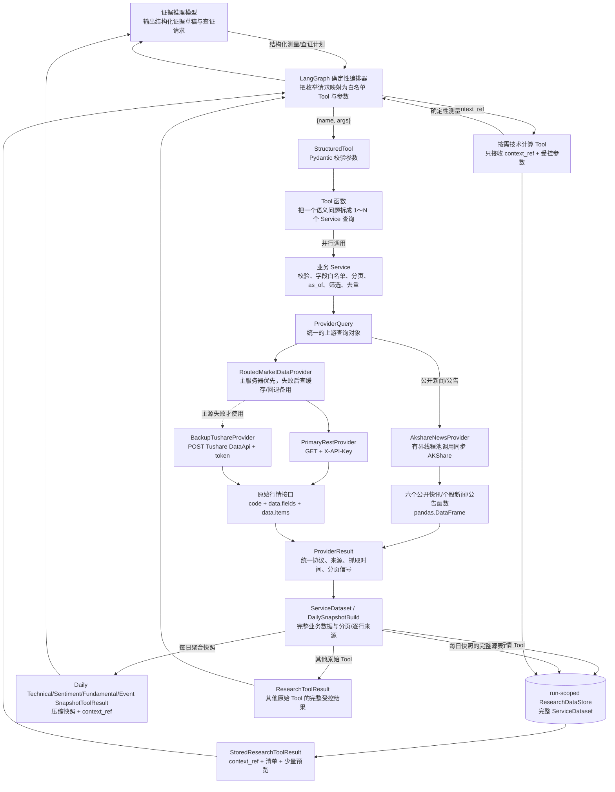

# StockResearchAgent 数据管线：Tool → Service → Provider → 原始接口

> 适用版本：v1.5
> 更新日期：2026-08-24
> 代码范围：`src/stock_research_agent/{agents,tools,services,providers,research_data}/`

本文说明一次 Agent 数据查询如何从语义 Tool 一直落到原始 HTTP 接口，以及响应如何沿相反方向逐层增加业务语义、完整性和可追溯信息。

完整的 30 个 Tool 参数表见 [`tool-call-reference.md`](tool-call-reference.md)，84 个源 Service 方法和
4 个聚合入口见 [`data-service-call-reference.md`](data-service-call-reference.md)。

## 1. 总体数据流



可以用熟悉的 Java 分层来理解：

| Python 层 | Java/Spring 类比 | 核心职责 |
|---|---|---|
| Tool | 给 Agent 编排器使用的受控 Controller/Facade | 暴露语义操作；行情 Tool 返回引用，计算 Tool 按引用生成确定性测量 |
| ResearchDataStore | 一次请求/会话内的临时数据仓库 | 安全保存完整 ServiceDataset，用 run-scoped `context_ref` 避免 LLM 搬运行情数组 |
| Service | Application Service | 把业务参数变成确定性数据查询，保证分页、截止时间和数据完整性 |
| Provider Protocol/Router | Repository/Gateway 接口及路由实现 | 屏蔽上游协议；Tushare 路径完成主备切换和缓存 |
| Primary/Backup Provider | Repository/HTTP Client 实现 | 注入凭据，真正发 HTTP 请求，统一解析响应 |
| AkshareNewsProvider | 公开数据适配器 | 在线程池调用同步 AKShare，标准化新闻/公告字段和真实来源 |
| 原始数据接口 | 外部数据库/第三方 API | 提供未经本项目业务加工的表格数据 |

Tool、Service、Provider 这条基础管线只返回受控原始数据或确定性技术计算，不单独生成观点
和投资建议。在它上方，已实现的 Technical、Sentiment/Flow、Fundamental 与 Event Evidence Agent
会让 LLM 生成结构化证据草稿，再由确定性装配器把草稿转换为 `EvidenceRecord`。Event 草稿除
真实 `source_call_ids` 外还必须引用直接支持事实的行级 `source_record_keys`。其上层的 Collector、
候选观点生成、逐观点查证、两位经理独立建议节点、确定性提案规范化、交叉评分严格 Schema、模型
适配器、双方并行评分、确定性写入、冲突评分校验及只重评违规经理的有界纠错循环已经实现。一次
首评加最多两次纠错，纠错不增加 `debate_round`；评分合法后的 `ConsensusGateNode` 与最多三轮正式
协商也已实现；轮次耗尽后未决条目转为 `EXCLUDED`，已实现的最终组装只消费 `AGREED` 条目。
第一版不设仲裁路由；所有终止分支会进入确定性的报告节点。

## 2. Tool 层：Agent 真正看得见的入口

### 2.1 调用方式

当前四位证据 Agent 都不给模型直接绑定 `StructuredTool`。模型先输出受 schema 约束的
测量或查证请求，LangGraph 编排器再把枚举类型映射成 Tool，并形成如下逻辑调用：

```json
{
  "name": "get_stock_price_context",
  "args": {
    "ts_code": "000001.SZ",
    "start_date": "2026-08-01",
    "end_date": "2026-08-20",
    "frequency": "daily"
  }
}
```

在 Python 测试或确定性代码里，可以等价地调用：

```python
result = await tool.ainvoke(
    {
        "ts_code": "000001.SZ",
        "start_date": "2026-08-01",
        "end_date": "2026-08-20",
        "frequency": "daily",
    }
)
```

编排器只能填写 Tool 对应 Pydantic 输入模型声明的业务字段，多余字段会被 `extra="forbid"`
拒绝。未来其他 Agent 即使选择直接 Tool-calling，也必须通过同一 schema 和角色白名单。

常见 Tool 输入字段：

| 字段 | 含义 |
|---|---|
| `ts_code` | Tushare 证券代码，例如 `000001.SZ` |
| `start_date` / `end_date` | ISO 日期区间，格式 `YYYY-MM-DD` |
| `trade_date` | 单个交易日 |
| `period` | 财报报告期，格式 `YYYYMMDD` |
| `frequency` | K 线频率，如 `daily`、`weekly`、`monthly` |
| `start_at` / `end_at` | 带时区的新闻时间窗口，单次不超过 24 小时 |
| `source` | 公开市场快讯来源：`ALL`、`EASTMONEY`、`THS`、`CLS` |
| `announcement_category` | 公开公告分类；由枚举限制，不接受任意上游参数 |
| 其他业务选项 | 如 `series`、`composition_type`、`exchange_id`，由具体 Tool 的 schema 限定 |

以下字段故意不允许 Agent 填写：

```text
as_of, run_id, api_name, provider, fields, limit, offset, token, api_key, raw rows, datasets
```

它们分别关系到时间旅行、接口选择、来源选择、数据范围、分页和密钥安全，必须由程序控制。

### 2.2 ToolContext 注入的字段

`ResearchToolContext` 在一次研究运行开始时由程序创建：

| 字段 | 类型 | 含义 |
|---|---|---|
| `services` | `DataServices` | 同一次运行共享的 9 个源 Service 和 4 个每日聚合 Service |
| `as_of` | 带时区 `datetime` | 本次研究冻结的“已知信息截止时间”，统一转换为上海时区 |
| `limits` | `ToolLimits` | 进入 LLM 上下文的数据体积上限 |
| `run_id` | string | 当前研究运行标识，用于隔离 `context_ref` |
| `data_store` | `ResearchDataStore` | 保存三个行情 Tool 及技术/情绪资金/基本面/事件每日快照所用的完整 `ServiceDataset` |

默认大小限制为：最多 500 行、单行最多 40,000 字符、整个 Tool 结果最多 200,000 字符。
三个存储型行情 Tool 每数据集默认只向 LLM 预览 5 行，限制针对预览而非 Store 内完整数据。

### 2.3 一个 Tool 可以组合多个 Service 查询

`get_stock_price_context` 并不对应某一个原始接口。日频会并行调用六个 Service 方法；
周/月频只调用前两个：

| Tool 数据集标签 | Service 方法 | 原始接口 |
|---|---|---|
| `price_bars` | `get_stock_bars(...)` | `daily` / `weekly` / `monthly` |
| `adjustment_factors` | `get_adjustment_factors(...)` | `adj_factor` |
| `daily_valuation_and_turnover` | `get_daily_valuation(...)` | `daily_basic`；仅日频 |
| `price_limits` | `get_price_limits(...)` | `stk_limit`；仅日频 |
| `suspensions` | `get_suspensions(...)` | `suspend_d`；仅日频 |
| `trade_calendar` | `get_trade_calendar(...)` | `trade_cal`；仅日频 |

因此 Tool 新增的第一个重要能力是“语义组合”：Agent 想问的是“给我股票价格上下文”，
无需背下两到六个底层接口，也不会让周/月线误带日频附属数据。

### 2.4 Tool 返回字段

除三个行情 Tool 和四个每日快照 Tool 外，普通原始 Tool 仍使用下述
`ResearchToolResult` 契约。

最外层 `ResearchToolResult`：

| 字段 | 含义 |
|---|---|
| `tool_name` | 实际执行的 Tool 名称 |
| `status` | `ok`、`empty`、`partial`、`error` 或 `too_large` |
| `as_of` | 本次运行冻结的研究截止时间 |
| `datasets` | 成功取得的一个或多个数据集 |
| `issues` | 失败数据集的结构化问题，不会伪装成空表 |
| `total_returned_items` | 所有成功数据集最终返回行数之和 |
| `complete` | 是否没有 issue，且所有数据集完整 |

每个 `ToolDatasetResult`：

| 字段 | 含义 |
|---|---|
| `label` | Tool 给数据集起的语义名称，如 `price_bars` |
| `api_name` | 该数据集最终对应的原始 API 名称 |
| `query_params` | Service 实际采用的业务查询参数；不含凭据和分页游标 |
| `requested_fields` | Service 固定要求的字段白名单 |
| `rows` | 数据行；每行包含 `data` 与 `source` |
| `received_item_count` | Service 从上游共收到多少行 |
| `returned_item_count` | 过滤、去重后交给 Tool 的行数 |
| `discarded_item_count` | 因本地筛选、`as_of` 或去重丢弃的行数 |
| `data_as_of` | 已接受数据中最新的有效业务日期 |
| `complete` | 该数据集是否完整 |
| `source_summary` | 按 Provider/缓存来源压缩后的页数、行数、字节数和抓取时间摘要 |

`rows[*].source` 包含：

| 字段 | 含义 |
|---|---|
| `provider` | `PRIMARY` 或 `BACKUP` |
| `from_cache` | 是否来自备用结果缓存 |
| `fetched_at` | 实际抓取时间 |
| `page_index` | 来自 Service 第几页，从 0 开始 |
| `source_offset` | 该行在上游分页序列中的原始偏移量 |

`issues[*]` 包含 `dataset_label`、`code`、`message`、`retryable`、`suggested_action` 和可选 `correlation_id`。这让 Agent 能区分“真的没有数据”和“某个接口失败了”。

三个行情 Tool 使用 `StoredResearchToolResult`，顶层增加 `context_ref`、
`total_stored_items`、`total_preview_items`，数据集把 `rows` 替换为 `preview_rows`，并显式给出：

| 字段 | 含义 |
|---|---|
| `stored_item_count` | Store 中保存的完整行数 |
| `preview_item_count` | 进入 LLM 上下文的预览行数 |
| `preview_complete` | 预览是否刚好覆盖完整数据；`false` 不表示存储数据不完整 |
| `preview_strategy` | 当前为 `provider_order_head`，即保留 Service 顺序的前几行 |

`partial` 会把成功子查询写入 Store 并返回 `context_ref`；所有子查询全失败时
`context_ref=null`。预览本身超限时可返回 `too_large`、清空预览，但仍保留 Store 引用。

每日技术快照 Tool 使用独立的 `DailyTechnicalSnapshotToolResult`，顶层返回 `tool_name`、
`status`、`as_of`、`context_ref`、`snapshot`、`issues`、`source_dataset_count`、
`total_stored_items` 和 `complete`。它不会伪装成带 `preview_rows` 的
`StoredResearchToolResult`；`context_ref` 指向生成快照的完整源数据集。

每日情绪资金快照同样使用独立的 `DailySentimentFlowSnapshotToolResult`。它在语义快照中返回
市场、行业、个股资金候选，在 `context_ref` 中保存技术背景和全部资金流源表；单项来源失败
通过 `issues` 和 `partial` 显式披露。

每日基本面快照使用 `DailyFundamentalSnapshotToolResult`。它返回估值、业绩事件、财务质量、
按 `stock_basic.industry` 聚合的行业横截面和宏观利率候选摘要，并把可能达到数千行的批量源表留在 `context_ref` 中；单项批量接口超时或
无权限会形成 `partial`，不会被伪装为空数据。

每日新闻事件快照使用 `DailyEventSnapshotToolResult`。它把三路公开快讯、近期公告、逐日卖方
研报摘要、当月券商荐股和当前上市股票目录保存到 `context_ref`，只把有界候选交给模型。股票目录
只用于精确连接新闻中出现的当前上市公司全名；研报和荐股候选明确保留“机构观点记录，不是结果
ground truth”的语义。Event 证据装配器再用 `source_record_keys` 回查快照原始行。

### 2.5 Tool 层新增了什么

1. 给 Agent 暴露 25 个有业务含义的数据 Tool 和 5 个技术计算 Tool，而不是把 89 个 Tushare API
   与 6 个 AKShare 函数直接交给模型。
2. 用输入 schema 阻止模型乱填接口名、字段、分页和凭据。
3. 给四位证据研究员配置不同的 Tool 白名单。
4. 把一个研究动作拆成若干 Service 查询并发执行。
5. 将异常转成 `issues`，并准确区分完整成功、空表、部分成功、失败和超限。
6. 保留逐行来源，同时给 LLM 提供压缩的来源摘要。
7. 阻止过大的原始结果直接挤爆模型上下文。

### 2.6 `ResearchDataStore` 和五个技术计算 Tool

三个行情原始 Tool 在 Service 完成分页、`as_of` 过滤和溯源后，把完整结果保存为
`ResearchDataBundle`。数据包记录 `kind`、`tool_name`、`as_of`、安全 metadata 和按 label 存放的
完整 `ServiceDataset`。Store 返回形如 `ctx_...` 的随机引用。

引用只在当前 `run_id` 中可读；不存在、已清理或属于另一个 run 的引用都不能被计算器
当作有效输入。第一版使用进程内 Store，不把 Store 对象或完整数据放进可持久化的
`ResearchGraphState`。

技术研究员可以在阅读清单和预览后按研究目的选择：

| 计算 Tool | 输入 | 新增能力 |
|---|---|---|
| `calculate_return_and_trend` | `context_ref`, `windows=(5,20,60)` | 收益、均线、斜率、交叉与突破 |
| `calculate_momentum` | `context_ref`, RSI/MACD/ROC 参数 | RSI、MACD、ROC 和背离 |
| `calculate_risk_and_tradability` | `context_ref`, `volatility_window=20`, `atr_period=14` | 通用价格风险；个股再增加涨跌停/停牌可交易性 |
| `calculate_volume_and_liquidity` | `context_ref`, `windows=(5,20)` | 通用核心量价；个股再增加 `daily_basic` 换手字段 |
| `calculate_relative_strength` | 目标/基准两个 ref，`windows=(20,60)` | 超额收益、相关性、Beta 和相对新高 |

计算器直接从 Store 读取完整行情，LLM 既不能传入 `raw rows`，也不能指定 `run_id`、
`as_of`、Provider 或原始 API。

五个 Tool 共用 `TechnicalCalculationToolResult` 外层信封，`calculation` 分别序列化为：

| 结果模型 | 主要输出 |
|---|---|
| `ReturnAndTrendResult` | 收益、SMA/EMA、均线斜率、价格相对均线、区间位置、交叉、突破 |
| `MomentumResult` | RSI、MACD、ROC、背离 |
| `RiskAndTradabilityResult` | 波动、ATR、回撤、跳空、交易日/停牌/涨跌停摘要 |
| `VolumeAndLiquidityResult` | 量额、相对量、换手率、量比、OBV、Amihud、量价组合计数 |
| `RelativeStrengthResult` | 日期对齐、目标/基准/超额收益、相关性、Beta、上下行超额、相对新高 |

每个单序列结果都有 `metadata`，记录样本数、起止日期、复权方式、是否实际复权和计算
告警。指标以 `status / sample_size / reason` 区分“可用”“历史不足”“输入缺失”和“不适用”；
`value=null` 不等于 0。相对强弱结果分别保留目标和基准的 metadata，并报告共同日期对齐情况。

五个计算 Tool 均可使用日频个股、市场/中证/申万行业指数和基金/ETF 引用。风险 Tool 对三类
目标计算波动、ATR、回撤和跳空；只有个股读取 `price_limits / suspensions / trade_calendar`。
量能 Tool 对三类目标计算量额均值、相对量、OBV、Amihud 和量价组合；只有个股读取
`daily_basic`。不适用字段明确返回 `not_applicable`，而不是 0、缺失或 `partial`。
基金显式不请求复权因子时按 raw 模式合法计算。短历史、缺可选输入或相关源数据不完整
不会伪装成完整成功：外层保留可用
`calculation`，但返回 `partial`、`complete=false` 和 `CALCULATION_INCOMPLETE` 或
`DATA_INTEGRITY`；必需数据缺失或引用组合非法则返回 `error` 和 `calculation=null`。

每个成功计算结果还返回 `source_subjects[]`，其中包含 `context_ref`、`bundle_kind`、
`ts_code` 和 `frequency`，使 Agent 能把结果可靠归属到个股、指数或基金。上述计算均为单标的
时间序列计算；市场宽度和板块参与度由已经实现的 `DailyTechnicalSnapshotService` 使用全市场
横截面、申万行业成分和行业日线确定性生成，不从单条指数 K 线猜测。

## 3. Service 层：确定性的业务查询与数据完整性

### 3.1 调用方式

Service 不给 LLM 直接调用，而由 Tool 或其他确定性代码调用：

```python
dataset = await services.equity_market_data.get_stock_bars(
    "000001.SZ",
    date(2026, 8, 1),
    date(2026, 8, 20),
    frequency="daily",
    as_of=frozen_as_of,
)
```

当前 `DataServices` 聚合了 9 个源 Service 和 4 个每日聚合 Service：

| 字段 | 负责内容 |
|---|---|
| `instrument_reference` | 股票、基金、指数、期权身份及交易日历 |
| `equity_market_data` | A 股和指数行情、估值、涨跌停、停复牌 |
| `cross_asset_market_data` | 基金、ETF、期权、可转债行情 |
| `fundamental_data` | 三大报表、财务指标、预告、快报、分红、审计等 |
| `macro_data` | 宏观经济、财经日历和利率 |
| `ownership_event` | 股东、质押、回购、解禁、增减持 |
| `trading_behavior` | 北向、龙虎榜、大宗交易、融资融券和特色资金流 |
| `news_event` | 旧 `major_news` 兼容查询，以及 `report_rc` 研报摘要、`broker_recommend` 月度荐股 |
| `public_news_event` | AKShare 全市场快讯、个股新闻和公告索引 |
| `daily_technical_snapshot` | 最近完整交易日的市场宽度、申万一级行业宽度、指数与异常候选聚合 |
| `daily_sentiment_flow_snapshot` | 复用技术背景，聚合市场/行业/个股资金流和涨跌停候选 |
| `daily_fundamental_snapshot` | 聚合估值、业绩事件、财务质量同比变化和宏观利率候选 |
| `daily_event_snapshot` | 聚合三路最近快讯、近期公告、卖方研报摘要、月度荐股和股票目录 |

前八个 Tushare 源 Service 共有 80 个公开业务方法，唯一覆盖当前 89 个 Tushare Provider API；
`PublicNewsEventService` 再增加 4 个业务方法，覆盖独立 `AkshareNewsProvider` 的 6 个函数。
普通源方法每次只返回一个原始 API 的数据集；四个 Daily Snapshot Service 分别为技术、情绪资金、
基本面和新闻事件每日模式生成确定性快照。

### 3.2 Service 方法把业务字段变成 Provider 字段

以 `get_stock_bars` 为例：

```python
get_stock_bars(
    ts_code,
    start_date,
    end_date,
    *,
    frequency="daily",
    as_of=None,
)
```

它会完成以下转换：

- 校验并大写证券代码；
- 校验日期先后关系；
- 阻止 `end_date` 晚于 `as_of`；
- 将 Python `date(2026, 8, 1)` 转为上游需要的 `"20260801"`；
- 将 `frequency="daily"` 解释为 `api_name="daily"`；
- 从 `ApiSpec` 取出固定字段，而不是接受调用者随意指定字段。

`daily` 的 `ApiSpec` 是：

```text
api_name: daily
fields: ts_code, trade_date, open, high, low, close, vol, amount
as_of_fields: trade_date
identity_fields: ts_code, trade_date
historical_as_of_safe: true
supports_offset_pagination: true
```

每个 `ApiSpec` 的字段：

| 字段 | 含义 |
|---|---|
| `api_name` | 唯一原始接口名 |
| `purpose` | 该接口的业务用途说明 |
| `fields` | Service 必须请求并校验存在的字段 |
| `as_of_fields` | 判断一行数据何时可被研究过程使用的日期字段 |
| `identity_fields` | 用来确定两行是否重复的业务主键 |
| `historical_as_of_safe` | 是否能可靠进行历史时点回放 |
| `supports_offset_pagination` | 上游是否接受 `limit/offset` 分页 |

### 3.3 BaseDataService 统一执行的工作

所有业务 Service 最终进入 `_query(api_name, params, as_of, row_filter)`。它会：

1. 检查当前 Service 是否真的拥有这个 API，防止跨 Service 随意调用。
2. 拒绝上层传入 `limit/offset`，分页只能由 Service 统一管理。
3. 默认按 `page_size=1000`、`max_pages=50`、`max_rows=50000` 分页。
4. 每一页构造一个 `ProviderQuery` 并调用统一 Provider。
5. 校验 API 名、返回字段和分页 schema 未发生变化。
6. 禁止同一个数据集分页期间在主源、备用源或缓存之间切换，避免拼接两个不同快照。
7. 检测重复页面、空页却声明 `has_more=true`、超过页数/行数等异常。
8. 对特殊兼容接口执行本地 `row_filter`，例如全市场停复牌数据按 `ts_code` 筛选。
9. 按 `as_of_fields` 删除研究截止时间之后的数据，避免未来信息泄漏。
10. 按 `identity_fields` 去重，并保留每行原来的来源位置。

任何完整性条件无法保证时，Service 会明确抛错，不会悄悄截断后声称结果完整。

### 3.4 Service 返回字段

`ServiceDataset` 字段：

| 字段 | 含义 |
|---|---|
| `api_name` | 本次查询的原始接口名 |
| `query_params` | 业务方法生成的基础上游参数，不含分页游标 |
| `requested_fields` | `ApiSpec` 固定字段 |
| `items` | 过滤和去重后的原始字典行；仍不是 Evidence |
| `item_traces` | 与 `items` 一一对应的行级来源记录 |
| `pages` | 所有远端分页请求的页级来源记录 |
| `as_of` | 规范化为日期后的研究截止日 |
| `data_as_of` | 被接受数据中最新的业务日期 |
| `received_item_count` | 上游返回的总行数 |
| `discarded_item_count` | 被筛选、截止时间检查或去重丢弃的行数 |
| `complete` | 数据集是否完整；当前正常完成为 `true`，不完整情况直接抛错 |

`ServicePageTrace` 记录 `page_index`、`provider`、`from_cache`、`fetched_at`、`offset`、`item_count`、`returned_fields` 和 `response_bytes`。

`ServiceItemTrace` 记录 `page_index`、`source_offset`、`provider`、`from_cache` 和 `fetched_at`。

### 3.5 Service 层新增了什么

1. 把“接口名 + 字符串参数”提升为有类型、有业务名称的方法。
2. 固定 API 归属和字段契约，不让上层任意取数。
3. 自动完成完整分页，而不是只取第一页。
4. 提供 `as_of` 截止时间，阻止未来数据进入历史研究。
5. 完成本地兼容筛选、去重、schema 校验和重复页检查。
6. 形成 `ServiceDataset`，同时保存页级和逐行来源。

Service 不使用 LLM，也不会做含主观判断的技术分析。均线、MACD、RSI、ATR 等由已实现的
确定性技术计算层处理，并通过计算 Tool 按需暴露给技术研究员。

## 4. Provider 层：统一协议、Tushare 主备路由和 AKShare 适配

### 4.1 统一接口调用方式

所有 Service 只依赖 `MarketDataProvider` 协议：

```python
result = await provider.query(
    ProviderQuery(
        api_name="daily",
        params={
            "ts_code": "000001.SZ",
            "start_date": "20260801",
            "end_date": "20260820",
            "limit": 1000,
            "offset": 0,
        },
        fields=(
            "ts_code",
            "trade_date",
            "open",
            "high",
            "low",
            "close",
            "vol",
            "amount",
        ),
    )
)
```

### 4.2 ProviderQuery 字段

| 字段 | 类型 | 含义 |
|---|---|---|
| `api_name` | `str` | 逻辑接口名，只允许小写字母、数字和下划线；由对应 Provider 白名单限制 |
| `params` | `dict[str, str/int/float/bool]` | 原始接口业务参数以及 Service 管理的 `limit/offset` |
| `fields` | `tuple[str, ...]` | 要求上游返回的字段列表，不允许重复 |

`params` 明确禁止 `token`、`api_key`、`apikey`、`x-api-key`；凭据只能由具体 Provider 从配置中注入。

### 4.3 RoutedMarketDataProvider 的路由过程

路由器收到 `ProviderQuery` 后：

1. 先检查 `api_name` 是否在 89 项 `SUPPORTED_APIS` 白名单内。
2. 每次都先请求主服务器。
3. 只有主服务器抛出 `ProviderError` 时才进入备用路径；合法空表不会触发回退。
4. 备用路径先按 `api_name + params + fields` 的稳定哈希读取缓存。
5. 同一个缓存键使用异步锁，避免并发请求同时击穿到备用服务器。
6. 缓存未命中才请求备用服务器。
7. 备用成功结果缓存 3600 秒；当前缓存只存在于本 Python 进程内。
8. 主、备都失败时合并两边原因，抛出 `DataSourceUnavailableError`。

这意味着当前策略是：

```text
主服务器成功（包括合法空表） → 直接返回
主服务器失败 → 备用缓存命中 → 返回缓存
主服务器失败 → 缓存未命中 → 请求备用服务器并缓存
主服务器失败 + 备用服务器失败 → 明确失败
```

### 4.4 三类具体 Provider 怎样调用上游

主服务器使用 REST GET：

```http
GET {PRIMARY_BASE_URL}/daily?ts_code=000001.SZ&start_date=20260801&end_date=20260820&limit=1000&offset=0&fields=ts_code,trade_date,open,high,low,close,vol,amount
X-API-Key: <PRIMARY_API_KEY>
Accept: application/json
User-Agent: StockResearchAgent/0.1
```

接口名中的下划线会转为连字符，例如 `daily_basic` 请求路径是 `daily-basic`。

备用服务器使用 Tushare DataApi POST：

```http
POST {BACKUP_BASE_URL}
Content-Type: application/json
Accept: application/json
User-Agent: StockResearchAgent/0.1
```

```json
{
  "api_name": "daily",
  "token": "<BACKUP_TOKEN>",
  "params": {
    "ts_code": "000001.SZ",
    "start_date": "20260801",
    "end_date": "20260820",
    "limit": 1000,
    "offset": 0
  },
  "fields": "ts_code,trade_date,open,high,low,close,vol,amount"
}
```

两种 Tushare 协议不同，但对 Service 来说都只有同一个
`query(ProviderQuery) -> ProviderResult`。

公开新闻/公告不经过 `RoutedMarketDataProvider`。`AkshareNewsProvider` 用最多
`AKSHARE_MAX_WORKERS` 个线程调用以下六个同步函数，并把中文 DataFrame 字段标准化成同一个
`ProviderResult`：

```text
stock_info_global_em
stock_info_global_ths
stock_info_global_cls
stock_news_em
stock_notice_report
stock_individual_notice_report
```

线程槽等待和函数调用都受 `AKSHARE_REQUEST_TIMEOUT_SECONDS` 约束。超时不能强制杀死正在执行的
Python 线程，因此执行槽会在真实任务结束后才释放，避免连续超时无限创建后台线程。

### 4.5 ProviderResult 字段

| 字段 | 含义 |
|---|---|
| `api_name` | 这次逻辑查询的接口名 |
| `provider` | 实际来源：`PRIMARY`、`BACKUP`、`AKSHARE_EASTMONEY`、`AKSHARE_THS` 或 `AKSHARE_CLS` |
| `from_cache` | 是否读取了备用结果缓存 |
| `fetched_at` | 这份响应实际取得的带时区时间戳 |
| `data_as_of` | Provider 预留的数据截止字段；当前主要由 Service 根据行内日期计算 |
| `fields` | 上游实际返回的字段顺序 |
| `items` | 已由二维数组转换成的字典行列表 |
| `provider_code` | 上游业务返回码，成功为 `0` |
| `has_more` | 是否需要继续取下一页 |
| `response_bytes` | 原始 HTTP 响应体字节数 |

### 4.6 Provider 层新增了什么

1. 让 Service 不依赖主、备服务器的 HTTP 细节或 AKShare 的 pandas 表结构。
2. 在最靠近网络的一层注入密钥，避免密钥沿调用链传播。
3. 每次优先主源，并为备用源提供缓存和并发防击穿。
4. 把网络、权限、认证、限流、业务码和 schema 错误转换为类型化异常。
5. 把二维 `fields/items` 响应转换成统一字典行。
6. 补充真实来源、缓存状态、抓取时间、响应体积和分页信号。

## 5. 原始数据接口：最底层的数据事实

两套服务器成功时都应返回 Tushare 风格结构：

```json
{
  "code": 0,
  "msg": null,
  "data": {
    "fields": ["ts_code", "trade_date", "open", "close"],
    "items": [
      ["000001.SZ", "20260820", 10.12, 10.35],
      ["000001.SZ", "20260819", 10.08, 10.12]
    ],
    "has_more": false
  }
}
```

字段意义：

| 字段 | 含义 |
|---|---|
| `code` | 上游业务返回码；HTTP 200 不等于业务一定成功 |
| `msg` | 错误或提示文本，用来分类限流、权限、认证等错误 |
| `data.fields` | 二维数据每一列的名称和顺序 |
| `data.items` | 原始二维表，每行列数必须与 `fields` 完全一致 |
| `data.has_more` | 可选分页标记 |

如果上游没有返回 `has_more`，Provider 会在“本页行数达到请求 `limit`”时推断可能仍有下一页。Service 随后增加 `offset` 继续查询；这可能多请求最后一个合法空页，但不会把一个恰好满页的结果误判为完整数据。

AKShare 六个函数返回 `pandas.DataFrame`，不使用上述 JSON 或 offset 分页。Provider 会校验当前
版本预期的中文列名，再标准化为英文行字段。公开快讯和个股新闻只代表网站最近若干条，Service
会把 `complete` 明确改为 `false`；全市场公告与指定个股公告只提供索引和原文 URL。

原始接口只负责“按接口参数返回数据”。它不知道：

- 哪位研究员在调用；
- 这个查询属于什么语义任务；
- 是否需要和其他接口组合；
- 本次研究的 `as_of` 是什么；
- 是否已经取完所有页；
- 哪些数据会进入 Evidence；
- 模型上下文是否装得下。

这些能力正是上面三层逐层增加的。

## 6. 一次完整调用的逐步展开

以技术研究员调用 `get_stock_price_context` 为例：

### 第一步：Agent → Tool

Agent 只表达业务意图：股票、日期区间和频率。Pydantic 校验代码格式、日期类型、区间和枚举。

### 第二步：Tool → 两个或六个 Service 方法

Tool 从 `ResearchToolContext` 读取固定 `as_of`。日频并行启动行情、复权、估值、涨跌停、
停复牌和代码所属交易所日历六个查询；周/月频只启动行情与复权两个查询。Agent 不需要知道
这些原始接口名。

### 第三步：Service → ProviderQuery

以行情分支为例，`get_stock_bars` 将日期转换为 `YYYYMMDD`，选择 `daily`，固定 OHLC、前收、
涨跌幅、成交量和成交额字段。`BaseDataService` 再加入 `limit=1000, offset=0`。

### 第四步：Router → 具体 Provider → HTTP

Router 检查 `daily` 在白名单中，然后调用主 REST Provider。主源失败时才查备用缓存或调用备用 Tushare Provider。

### 第五步：原始 JSON → ProviderResult

Parser 校验 `code`、`data.fields`、`data.items` 和每行列数，将：

```json
{"fields":["ts_code","trade_date"],"items":[["000001.SZ","20260820"]]}
```

转换为：

```json
{"items":[{"ts_code":"000001.SZ","trade_date":"20260820"}]}
```

并补上 `provider`、`fetched_at`、`has_more`、`response_bytes`。

### 第六步：ProviderResult → ServiceDataset

Service 继续分页，验证字段和来源一致，应用 `as_of`，去重，并给每一行绑定来源位置，最后形成一个完整的 `ServiceDataset`。

### 第七步：两个或六个 ServiceDataset → ResearchDataStore

`get_stock_price_context` 是存储型行情 Tool。它把成功的完整 `ServiceDataset` 写入当前 run
的 Store，获得 `context_ref`，只把数据清单和每个数据集默认 5 行预览放进
`StoredResearchToolResult`：

- 全部成功且有数据：`status="ok"`；
- 全部成功但都为空：`status="empty"`；
- 一部分成功、一部分失败：`status="partial"`；
- 全部失败：`status="error"`；
- 预览超过上下文保护上限：`status="too_large"`，但保留 `context_ref`。

`partial` 只保存成功数据集，失败部分在 `issues` 中显式披露；全失败则没有引用。

### 第八步：Agent 按需选择技术计算 Tool

Agent 先阅读 manifest 与预览，然后把 `context_ref` 交给收益趋势、动量、风险、量能或相对强弱
计算器。计算器从 Store 读取完整数据并返回确定性结果；Agent 不需要也不允许把数百行
K 线复制到下一次 Tool 调用。

## 7. 每一层到底新增了什么

| 层级 | 接收到的东西 | 向上新增的东西 |
|---|---|---|
| 原始接口 | HTTP 参数 | 最原始的表格事实与业务返回码 |
| Concrete Provider | `ProviderQuery` | 协议适配、凭据、错误分类、字典行、实际来源和抓取信息 |
| Router Provider | `ProviderQuery` | API 白名单、主源优先、备用缓存、故障转移 |
| AkshareNewsProvider | `ProviderQuery` | 同步函数线程隔离、字段漂移校验、来源/时间/URL 标准化 |
| Service | 业务参数 | 接口/字段选择、类型转换、完整分页、`as_of`、筛选、去重和逐行溯源 |
| ResearchDataStore | 完整 `ServiceDataset` + `run_id` | 当前 run 内不透明引用、完整数据保存与跨 run 隔离 |
| 原始 Tool | Agent 业务参数 | 多 Service 语义组合、角色权限、结构化状态/issues；行情只返回引用和预览 |
| 技术计算 Tool | `context_ref` + 受控参数 | 基于完整数据的可复现指标，避免 LLM 搬运数组或心算 |
| Technical Evidence Agent | 每日快照 + 原始 Tool 结果 + 确定性计算结果 | 已实现每日/查证模式，输出经程序核验来源的 `EvidenceRecord` |
| Sentiment/Flow Evidence Agent | 每日资金快照 + 个股资金/持仓/异常交易 Tool 结果 | 已实现每日/查证模式，保留口径差异并硬校验标的与来源 |
| Fundamental Evidence Agent | 每日基本面快照 + 六类个股查证 Tool 结果 | 已实现每日/查证模式，硬校验股票身份、报告期、调用来源和预算 |
| Event Evidence Agent | 全市场快讯/公告/研报/荐股快照 + 个股新闻公告/卖方研究/公司事件 Tool | 已实现每日/查证模式；逐行核验 `record_key`，区分媒体报道、公司披露和卖方观点 |
| EvidenceCollectorNode | 四位研究员的 `EvidenceRecord` | 冻结时点、来源和运行边界核验，以及可供推理的 `EvidenceCollection` |
| LeadResearchStrategist | 全部合法证据摘要 | 带真实证据引用、状态为 `UNVERIFIED` 的候选 `ThesisRecord` |
| ThesisValidationAnalyst | 当前观点、相关全局证据和连续查证历史 | 每轮一个请求或最终状态；即时补证结果以 `ResearchFinding` 回到同一观点 |

一句话概括：

```text
Provider 解决“从哪里、怎么可靠取到一页数据”；
Service 解决“怎样得到一个符合业务语义且完整的数据集”；
Tool 解决“Agent 应该怎样安全地提出研究问题并按需取得原始或派生上下文”；
ResearchDataStore 解决“完整数据不经过 LLM 还能怎样在 Tool 间安全复用”。
```
