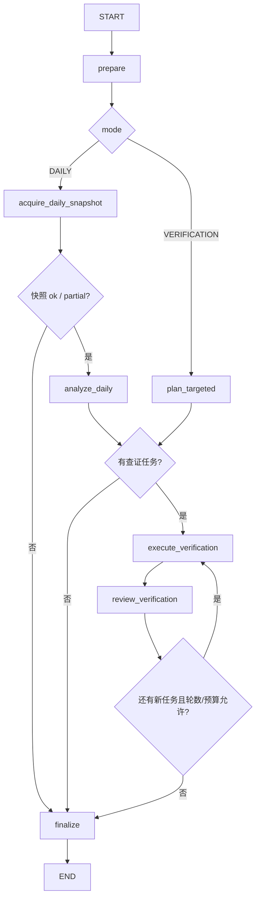

# EventDrivenResearchAnalyst v1

> 实现状态：每日模式、`ResearchRequest` 查证模式、有限补证循环、结构化证据装配和主图适配器已实现。
> 本文描述当前代码契约；真实上游和真实 LLM 仍需分别做联调，离线测试通过不代表新闻已完整覆盖。

## 1. 职责边界

`EventDrivenResearchAnalyst` 是新闻事件与催化剂研究员。它只形成来源可追溯、时点冻结的事件观察，包括：

- 全市场财经新闻、政策和突发事件；
- 上市公司公告、风险提示和业绩披露；
- 卖方研报结构化元数据、评级、目标价与盈利预测；
- 月度券商金股名单；
- 指定股票的新闻、公告、公司行动和业绩披露。

它不预测股价，不输出买卖、仓位或目标价建议，也不把媒体报道、券商观点或市场传闻升级成
公司已经确认的事实。新闻可以直接形成“某来源在某时报道了某事件”这一证据；如果正文或公司公告
没有确认，证据的措辞和 `limitations` 必须保留这个来源口径。

卖方研报和券商荐股同理：可验证事实是“某机构在某日发表了某评级、预测或推荐”，而不是该预测
必然兑现。`report_rc` 只提供结构化研报元数据、评级、目标价和预测字段，不等于已经取得研报全文；
`broker_recommend` 是月度名单，不是日频研究结论；当前 Provider 也不能可靠地按历史 `as_of`
重放该名单，因此历史回测不得把今天取得的月度名单倒灌到过去。

## 2. LangGraph 子图



入口：

```python
event_graph = build_event_agent_graph(
    model=event_reasoning_model,
    tool_context=research_tool_context,
)
```

嵌入主图时传入 `event_agent_graph_factory`。四位证据研究员当前仍按技术、情绪资金、基本面、
新闻事件的临时顺序串行执行；逐观点查证、独立投资建议、交叉评分和正式协商已经实现。证据
研究员的证据汇合、共识建议组装和最终报告均已实现；v1 不设仲裁路由。

## 3. DAILY：每日新闻事件模式

```python
await event_graph.ainvoke(
    {
        "run_id": run_id,
        "target": market_target,
        "as_of": frozen_as_of,
        "mode": "DAILY",
    }
)
```

固定流程：

1. 程序调用一次 `get_daily_event_snapshot`；
2. 一次向 LLM 输入全市场公开快讯、近期公告、近期卖方研报结构化元数据和当月券商荐股候选；
3. LLM 输出快照已直接支持的 `EventEvidenceDraft[]`，以及少量需要继续补证的问题；
4. 程序只允许候选中已经确定性识别的 A 股股票进入股票级查证；
5. 查证枚举被程序映射为固定 Tool，先核对证券身份，再执行新闻公告、卖方研究、公司行动或业绩披露查询；
6. LLM 审阅实际结果；如果发现重要冲突或缺口，可在硬预算内提出一次有限补证；
7. 确定性装配器核验调用编号、行级 `record_key`、标的、时点和来源，生成 `EvidenceRecord[]`。

与另外三位证据 Agent 不同，每日模式允许新闻本身直接形成股票级证据。例如，新闻明确点名某上市
公司并报道突发产品事故时，可以输出“该媒体在该时间报道了该公司的该事件”。这不要求先经过一次
个股查证，但必须满足：

- 新闻候选具有可引用来源；
- 新闻文本直接点名该上市公司，且程序已将名称确定性解析为该 `ts_code`；
- 证据只描述来源确实报道的内容，不补写原因、损失、供应链影响或未来价格后果；
- 仍保留“媒体报道、尚未被公告确认”等限制。

### 3.1 不得把未上市公司映射成概念股

如果新闻主体是未上市公司、品牌、产品或人物，程序和 LLM 都不得自行寻找“概念股”“影子股”或
供应链公司并生成这些上市公司的证据。只有当原始来源直接点名某一家 A 股公司，或另一个可引用
来源明确证明其关系时，才能将证据目标设为该股票。

例如，关于某未上市机器人公司的事故新闻，只有在内容直接支持当前 MARKET 研究范围时才能保留为
市场事件观察；否则可以不产出证据。无论如何都不能仅凭模型知识把它改写成某只机器人概念股的
公司事件。若这条关系值得研究，也必须由后续有合法来源的流程建立关系，而不是在当前股票证据或
查证请求中臆测映射。

## 4. VERIFICATION：指定个股查证模式

观点审查节点产生 `assigned_domain=EVENT` 的股票 `ResearchRequest` 后调用：

```python
await event_graph.ainvoke(
    {
        "run_id": run_id,
        "target": research_request.target,
        "as_of": frozen_as_of,
        "mode": "VERIFICATION",
        "research_request": research_request,
    }
)
```

该模式不会重新扫描全市场。程序自动先调用 `resolve_stock_identity`，随后只接受四种受控检查：

```text
NEWS_DISCLOSURES   -> get_targeted_news_and_disclosures
SELL_SIDE_RESEARCH -> get_sell_side_research_context
CORPORATE_ACTIONS  -> get_corporate_action_events
EARNINGS_DISCLOSURE -> get_earnings_and_disclosure
```

- `NEWS_DISCLOSURES` 联合查指定股票新闻和公告索引；
- `SELL_SIDE_RESEARCH` 查询该股区间卖方研报摘要，并补充相应月份的券商荐股记录；
- `CORPORATE_ACTIONS` 查询回购、解禁、股东增减持和分红；
- `EARNINGS_DISCLOSURE` 查询预告、快报与披露日程，必须提供季度末 `report_period`。

所有日期窗口都受冻结的 `as_of`、`ResearchRequest.time_range` 与本地最大回看天数约束。第二轮只能
继续研究第一轮已授权的股票，不能借“发现关联公司”换标的。
`NEWS_DISCLOSURES` 的单次窗口最多 31 天；这项限制已放进结构化请求 Schema，模型不能先生成
更长窗口、再等到 Tool 层才失败。

## 5. 结构化输出与行级 citation

每日分析固定返回：

```json
{
  "snapshot_evidence": [],
  "verification_requests": [],
  "market_summary": "只索引前两项已表达重点，不新增事实、预测或建议"
}
```

单条证据草稿必须同时引用真实 Tool 调用和直接支持它的原始行：

```json
{
  "target": {"type": "STOCK", "code": "000001.SZ", "name": "平安银行"},
  "title": "某券商发布对平安银行的研究评级",
  "description": "某券商在报告日发布研报摘要并给出该评级；这是卖方观点记录，不代表预测已经实现。",
  "source_call_ids": ["ec_daily_snapshot"],
  "source_record_keys": [
    "report_rc:000001.SZ:20260820:示例机构:示例作者:示例标题:2026Q1",
    "report_rc:000001.SZ:20260820:示例机构:示例作者:示例标题:2026Q2"
  ],
  "tags": ["卖方研报"],
  "limitations": ["未取得研报全文", "评级与盈利预测属于卖方观点"]
}
```

`source_call_ids` 只能引用本次子图真实执行且状态可用的调用；`source_record_keys` 必须能在该调用
保存的数据包中反查到具体原始行。程序不会用一个快照级粗粒度来源替代行级引用，也不会允许一条
新闻或研报行支撑其中没有表达的附加结论。

每日快照会把同一份研报的多个预测期、以及同一股票的多家券商月度推荐聚合成候选。此类候选使用
`supporting_record_keys` 保存全部构成行；若证据描述聚合后的预测期、机构数量或券商名单，必须
完整引用这些键。确定性装配器会拒绝只引用其中一部分原始行的聚合结论。

公开新闻候选还会保留来源 URL、发布时间和 `citable`。URL 进入原始数据包，
`EvidenceRecord.source_refs[]` 当前提升 `provider`、`interface`、`record_key`、`published_at`、
`fetched_at`、`data_as_of` 和可用的原始 `url`。

## 6. `citable`、`empty`、`partial` 与完整性

| 状态/字段 | 正确解释 | 禁止解释 |
|---|---|---|
| `citable=true` | 公开新闻/公告有可追溯 URL，或结构化研报/荐股行有可反查的行级定位 | 原文内容必然真实、已经被公司确认，或已经取得研报全文 |
| `citable=false` | 可用于事件发现或与其他来源交叉验证 | 单独形成确定性的公司事实 |
| `status=empty` | 精确接口、标的和窗口下返回零行；可记录为未解决问题 | 生成没有行级引用的 `EvidenceRecord`，或声称公司近期绝无新闻、公告或研报 |
| `status=partial` | 只可使用成功的数据集；程序自动把失败/缺失数据集追加到 `limitations` | 将失败的数据源当成零记录，或隐藏缺失来源 |
| `complete=false` | 当前接口不保证穷尽请求时间窗 | 对“没有看到”作否定性结论 |
| `status=error/too_large` | 本次调用不能直接支撑证据 | 把错误或截断结果解释成事实 |

AKShare 的全市场快讯和个股新闻只返回各站点最近若干条，因此即使时间过滤后为空也不能证明窗口内
没有新闻。公告是索引与 URL，不等于程序已经下载并解析公告正文。卖方研报元数据和月度荐股也不等于
取得了完整研究报告。顶层 Tool 即使 `status=ok`，只要 `complete=false`，证据仍会被程序自动标记为
不完整并进入 `UNVERIFIED`，不能由 Prompt 掩盖覆盖缺口。

## 7. Schema 硬约束与 few-shot

三个 LLM 通道分别使用：

```text
DailyEventAnalysis
TargetedEventPlan
EventReviewDecision
```

模型通过 `with_structured_output(...)` 输出固定 schema，随后还要经过 Pydantic 与确定性业务校验。
Prompt 文本不能替代程序校验；即使模型生成了语法正确的 JSON，只要引用、标的、日期或预算不合法，
相应草稿仍会被拒绝。

每日 Prompt 的 few-shot 只演示以下边界：

- 可引用的公司突发新闻可以直接形成股票级“来源报道事实”；
- 未上市主体的新闻不能自动映射为 A 股概念股；
- 卖方评级只能写成机构观点记录；
- `citable=false` 或 `status=empty` 的结果只用于发现、限制说明或产生查证请求，不能形成证据；
- `partial`/`complete=false` 的成功行可以保留，但程序会自动把覆盖缺口写入限制并降低验证状态；
- 输出只能包含 schema 字段，示例中的公司、日期、数值和调用编号都不得复用。

当前 few-shot 放在每日 Prompt 中；定向规划与复核 Prompt 使用固定 checks、严格 schema 和明确
规则约束，不另放长示例，避免示例中的公司或结论污染定向任务。它们分别要求最小检查集合，以及
区分公告、媒体报道和卖方观点、保留冲突并只在必要且预算允许时提出一次补证。

三份完整 Prompt 位于：

```text
src/stock_research_agent/agents/event/prompts.py
```

## 8. 循环与硬预算

| 限制 | 默认值 |
|---|---:|
| 每组每日候选数量 | 6 |
| 新闻回看 | 24 小时 |
| 公告回看 | 3 个自然日 |
| 查证轮数 | 2 |
| 每轮最多请求 | 4 |
| 子图总 Tool 调用 | 16 |

身份核对和业务 Tool 都计入预算。相同股票、检查类型和时间窗口按指纹去重；程序在执行前检查剩余
预算，达到上限就停止并保留 `unresolved_questions`，不会让 Prompt 自行决定无限重试。

## 9. 当前边界

- 最近快讯不是可回放的完整历史新闻库；长期每日归档尚未实现；
- 公告目前保存索引和 URL，正文下载、PDF 解析与公告段落级引用尚未实现；
- `report_rc` 不含研报全文，月度荐股也不提供完整推荐理由；
- 实体连接第一版只允许确定性识别已上市 A 股，不做概念股、供应链或受益标的推断；
- `ResearchDataStore` 仍是进程内实现，重启后不能恢复快照引用；
- 事件 observation 尚未进入长期 ArtifactStore；
- 观点生成和逐观点查证已实现；投资经理辩论、报告持久化与真实部署仍未完成。
