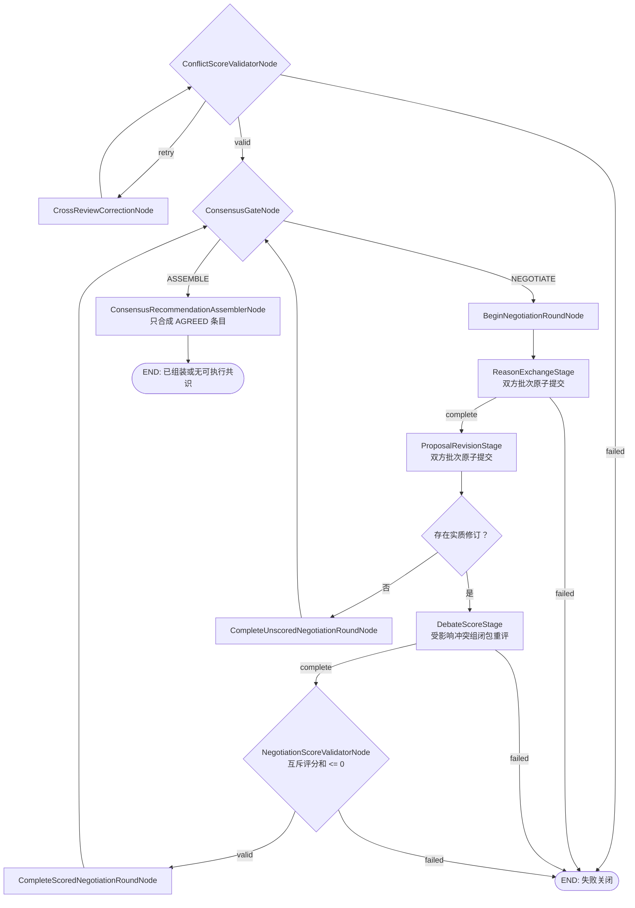

# 共识门与正式协商节点实现契约 v1

## 1. 当前实现边界

评分合法后的 `ConsensusGateNode`、三阶段正式协商、修订应用、正式重评校验和最多三轮循环已经接入
主 LangGraph，并已接入受限的 `ConsensusRecommendationAssemblerNode`。当前实现只会把运行确定性地路由到：

- `NEGOTIATE`：尚有可协商条目且未耗尽轮次；
- `ASSEMBLE`：没有待协商条目，或三轮后已把未决条目固化为 `EXCLUDED`；
- 失败关闭：来源、Schema、上下文、模型批次或互斥评分不合法。

第一版不设主席、仲裁节点或 `ARBITRATE` 路由。`ASSEMBLE` 进入已实现的共识建议组装器，组装器执行后才
连到 `END`。

## 2. 实际 LangGraph 路由



首次交叉评分纠错只修正进入正式协商前的非法分数，不增加 `debate_round`。正式协商重评违法时不会
复用这套纠错循环，而是直接失败关闭。

## 3. 共识门

单条建议通过必须同时满足：

```text
aggressive_score + conservative_score > 0
min(aggressive_score, conservative_score) >= -0.25
hard_veto = false
```

Gate 还会先验证每位经理对每一对仍存活互斥条目的评分和 `<= 0`。该不变量保证同一冲突组的两个
互斥条目不可能同时通过。一个条目通过后冻结为 `AGREED`，同组其他存活冲突条目转为 `REJECTED`。

总体研究目标必须具有 `ACTION`、`HORIZON`、`RISK_CONTROL` 三个已通过维度，才能路由
生成可执行的 `consensus_recommendation`。轮次未耗尽且存在 `NEGOTIATING` 条目时路由
`NEGOTIATE`；达到 `max_rounds` 后仍未解决的条目进入 `excluded_item_ids`，状态固化为 `EXCLUDED`，随后路由
`ASSEMBLE`。即使缺少必需维度，也不进入其他决策节点；组装器以 `no_actionable_consensus` 正常结束。

## 4. 一轮正式协商的三个原子阶段

### 4.1 理由交换

`exchange_negotiation_reasons` 并发调用当前有工作的经理。每位经理只回应对方仍处于
`NEGOTIATING` 的条目，可以给出支持、反对、风险、事实纠正和修改方向，但不能修改建议或重评分。

模型输出 `ReasonExchangeDraft`；节点校验完整覆盖、顺序、版本、观点引用和己方关联条目后，装配
`ReasonExchangeRecord`。只要任一经理失败，整阶段不提交任何一方的 Record。

### 4.2 原提议方修订

`revise_negotiation_proposals` 让每位原提议方针对对方理由，对本人全部待协商条目选择：

- `KEEP`：正文、引用、状态和版本完全不变；
- `MODIFY`：真正改变正文或支持观点集合，状态保持 `NEGOTIATING`，版本恰好加一；
- `WITHDRAW`：只把状态改为 `WITHDRAWN`，版本恰好加一。

双方修订同样按批次原子提交。节点从前后快照确定性计算 `changed_fields` 与 `material_change`，模型
不能自行声称发生了实质变化。

### 4.3 受影响冲突组闭包重评

只有至少一条修订为实质变化时，系统才建立：

```text
material_change_item_ids
  -> touched_conflict_groups
  -> rescore_item_ids
```

`rescore_item_ids` 包含所有被触及冲突组中仍存活且未 `AGREED` 的条目；即使某个兄弟条目正文没有
修改，也必须与新版本一起重评。闭包之外的条目沿用旧分。两位经理都必须完整评分闭包，且整批原子
写回 `DebateScoreRecord`。

若本轮全部为 `KEEP`，则跳过重评模型和正式评分校验，但仍写入
`NegotiationRoundSummary(stop_reason="no_material_change")`。由于轮次已经在入口增加，这种无变化轮
仍消耗一轮，随后回到共识门；只有耗尽轮次时才把仍未决条目排除后进入组装。

## 5. 最终组装出口

`ConsensusRecommendationAssemblerNode` 只读取 Gate 的 `agreed_item_ids`，只把这些条目和它们精确引用的
`SUPPORTED/MIXED` 观点交给受限结构化模型。模型只能压缩顶层文字；条目集合、信心度、ID、辩论摘要和生命周期
均由程序装配。信心度取全部纳入观点的最小信心度。

若没有 `AGREED` 条目，或缺少总体目标的 `ACTION/HORIZON/RISK_CONTROL`，节点不调用模型，
保持 `consensus_recommendation = null`，并写入
`ConsensusAssemblyRunSummary(stop_reason="no_actionable_consensus")`。两份原始经理建议不受影响。详见
[`consensus-recommendation-assembler-v1.md`](consensus-recommendation-assembler-v1.md)。

## 6. 轮次、记录与失败语义

- `debate_round` 在进入一轮时增加，默认最多 `3` 轮，配置也只能位于 `1..3`；
- `ReasonExchangeRecord`、`ProposalRevisionRecord`、`DebateScoreRecord` 均带稳定 ID、轮次和来源指纹；
- `NegotiationStageRunSummary` 用 `requested/called/staged/completed` 四组经理证明批次是否原子提交；
- `NegotiationModelRunSummary` 保存每位经理每阶段的调用和上下文情况；
- `NegotiationRoundSummary` 保存本轮交换、修订、评分和实质变化计数；
- Gate 报告按轮次、三类 Record 按稳定 ID、阶段摘要按“轮次+阶段”、模型摘要按
  “轮次+阶段+经理”使用不可变 reducer；相同输入可幂等重放，不兼容内容不能覆盖历史；
- 上下文超限、缺输入、模型异常、结构化输出被拒、批次应用失败或评分不变量违法都会失败关闭。

## 6. Builder 配置契约

正式协商必须成对注入 `aggressive_negotiation_model` 与 `conservative_negotiation_model`；只配置一方会
在建图时抛错。启用正式协商前还必须先成对配置两位交叉评分模型。`NegotiationLimits` 同时传给共识门、
轮次入口和三个模型阶段，确保轮次与上下文边界一致。

结构体完整字段见
[`formal-negotiation-schema-v1.md`](formal-negotiation-schema-v1.md)，全局设计边界见
[`research-agent-v1-design.md`](research-agent-v1-design.md)。
