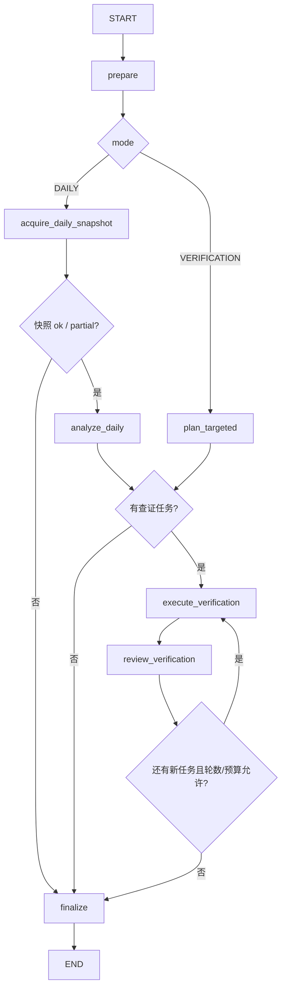

# FundamentalResearchAnalyst v1

> 实现状态：每日模式、`ResearchRequest` 查证模式、有限补证循环、结构化证据装配和主图适配器已实现。
> 本文描述当前代码，不是远期设想。

## 1. 职责边界

`FundamentalResearchAnalyst` 只形成可追溯的基本面观察事实，包括：

- 宏观与利率序列的最近两期观测；
- 按 `stock_basic.industry` 口径形成的行业估值、财务质量和近期披露活动横截面；
- 全市场估值极值、财务质量极值，以及新出预告和快报的代表性个股；
- 指定个股的财务报表、盈利质量、业绩披露、估值历史、分红股东和质押风险。

它不预测股价，不输出买卖、仓位或目标价建议，不把低估值、高 ROE 或某次预增直接解释成
“值得买入”，也不把相关性写成因果关系。

每日快照中的行业口径来自股票目录的 `industry` 字段，**不是申万行业分类**。程序会在输出中
保留该口径、有效样本数和代表股，避免模型把一个聚合中位数误写成全部行业成分的事实。

## 2. LangGraph 子图



入口：

```python
fundamental_graph = build_fundamental_agent_graph(
    model=fundamental_reasoning_model,
    tool_context=research_tool_context,
)
```

嵌入主图时传入 `fundamental_agent_graph_factory`。当前临时主图按技术、情绪资金、基本面的顺序
串行执行；四位证据研究员的并行汇合会在新闻事件 Agent 完成后再接入。

## 3. 每日模式

```python
await fundamental_graph.ainvoke(
    {
        "run_id": run_id,
        "target": market_target,
        "as_of": frozen_as_of,
        "mode": "DAILY",
    }
)
```

固定流程：

1. 程序调用一次 `get_daily_fundamental_snapshot`；聚合结果过大时只允许把候选数缩到 3 重试一次；
2. LLM 一次读取宏观与利率、行业横截面、估值候选、近期预告/快报和财务质量候选；
3. LLM 输出快照已经直接证明的 `FundamentalEvidenceDraft[]`；
4. LLM 只为少数候选股票提出需要进一步验证的问题；
5. 程序把六类检查枚举映射为固定 Tool，并自动先核对股票身份；
6. LLM 审阅实际结果，可在硬预算内提出一次补证；
7. 确定性装配器核验调用编号、状态、标的、报告期和来源，生成 `EvidenceRecord[]`。

每日模式关注三个层次：

- **市场**：宏观和利率最近两期的原始观测；
- **行业**：估值、财务质量和近期披露活动的横截面候选；
- **代表股**：尤其是新出预告、快报，以及横截面上显著的个股。

市场或行业事实可以直接来自每日快照；进一步查证第一版只接受股票。行业中位数、候选排名和
单期披露都不能单独证明未来趋势、公司质量或投资价值。

## 4. 指定个股查证模式

外部观点审查节点产生 `assigned_domain=FUNDAMENTAL` 的股票 `ResearchRequest` 后调用：

```python
await fundamental_graph.ainvoke(
    {
        "run_id": run_id,
        "target": research_request.target,
        "as_of": frozen_as_of,
        "mode": "VERIFICATION",
        "research_request": research_request,
    }
)
```

它不会重新扫描全市场。LLM 只输出六类受控检查：

```text
FINANCIAL_STATEMENTS -> get_financial_statements
FINANCIAL_QUALITY    -> get_financial_quality
EARNINGS_DISCLOSURE  -> get_earnings_and_disclosure
VALUATION_HISTORY    -> get_valuation_context
DIVIDEND_OWNERSHIP   -> get_dividend_and_ownership_context
PLEDGE_RISK          -> get_pledge_risk_context
```

`resolve_stock_identity` 由程序自动调用，不需要模型选择。报告期类检查必须填写季度末
`report_period`；需要同比时可填写更早的 `comparison_period`。历史估值和股东人数等日期窗口会
被程序限制在冻结的 `as_of` 与 `ResearchRequest.time_range` 内。

## 5. 结构化输出和硬校验

每日分析固定返回：

```json
{
  "snapshot_evidence": [],
  "verification_requests": [],
  "market_summary": "只索引前两项重点，不新增事实、原因或建议"
}
```

每个查证请求由模型描述“查什么”，而不是“怎样访问上游”：

```json
{
  "target": {"type": "STOCK", "code": "000001.SZ", "name": "平安银行"},
  "question": "近期预增是否得到正式报表与现金流质量支持？",
  "requested_evidence": "核对本期、上年同期及不同披露层级的支持与冲突。",
  "checks": ["EARNINGS_DISCLOSURE", "FINANCIAL_STATEMENTS", "FINANCIAL_QUALITY"],
  "report_period": "20260630",
  "comparison_period": "20250630",
  "lookback_days": 365,
  "composition_type": "P",
  "priority": "HIGH",
  "reason": "该公司进入近期预告改善候选，但快照不足以证明盈利质量。"
}
```

程序拒绝以下内容：

- 不在每日候选或外部 `ResearchRequest` 授权范围内的股票；
- 未来报告期、非季度末报告期或不合法的同期顺序；
- 不存在、失败或属于其他股票的 `source_call_ids`；
- 只引用 `resolve_stock_identity` 的“基本面证据”；身份结果只作为执行闸门，不能证明财务事实；
- 上游忽略 `ts_code` 过滤后返回其他股票的数据；
- 上游实际返回的报告期或估值日期与程序请求不一致的数据；
- 指定查证中落在 `ResearchRequest.time_range` 之外的主报告期；
- 用 `error/too_large` 支撑证据，或把 `empty` 扩写成永久性结论；
- 第二轮换标的、重复同一请求，或绕过 Tool 调用预算。

## 6. 循环与预算

| 限制 | 默认值 |
|---|---:|
| 每个每日候选组数量 | 6 |
| 近期披露回看天数 | 14 |
| 查证轮数 | 2 |
| 每轮最多请求 | 4 |
| 子图总 Tool 调用 | 20 |
| 主图基本面 `ResearchRequest` | 12 |

身份核对和每个具体业务 Tool 都计入预算。跨期报表、质量或业绩检查会展开为本期与同期两次调用；
同一轮相同股票、Tool 和参数只预留并执行一次。程序在执行任务前预留整个任务所需预算，避免只完成
半个任务后再被截断。

## 7. LLM 与 Prompt

模型复用全局 `LLMSettings`：

```python
fundamental_model = OpenAIFundamentalReasoningModel(
    chat_model,
    structured_output_method=settings.structured_output_method,
)
```

三份完整 Prompt 位于：

```text
src/stock_research_agent/agents/fundamental/prompts.py
```

- `DAILY_ANALYSIS_SYSTEM_PROMPT`
- `TARGETED_PLANNING_SYSTEM_PROMPT`
- `VERIFICATION_REVIEW_SYSTEM_PROMPT`

三个通道分别使用 `DailyFundamentalAnalysis`、`TargetedFundamentalPlan` 和
`FundamentalReviewDecision` 作为结构化输出 Schema，再执行本地 Pydantic 与确定性业务校验。
每日 Prompt 包含一组市场、行业和代表股查证的 few-shot；示例只演示结构，示例值不得复用。

当前单元测试使用 scripted fake model，不访问真实 LLM。基本面三个 Schema 尚未在真实 Qwen
端点做独立 smoke test，因此离线测试通过不等于真实模型联调已经完成。

## 8. 当前边界

- 行业口径目前是 `stock_basic.industry`，尚未切换到申万行业成员与指数口径；
- 宏观接口的历史修订值尚不能保证严格 point-in-time 回放；
- `ResearchDataStore` 仍是进程内实现，重启后不能恢复快照引用；
- 基本面 observation 尚未进入长期 ArtifactStore；
- 新闻事件 Agent、观点生成、逐观点查证、投资经理协商和报告生成已实现；报告持久化仍未实现。
