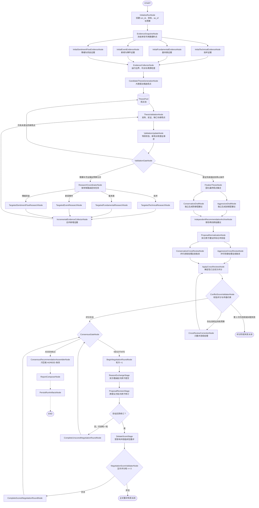

# A 股投研 Agent 第一版设计

> 文档状态：v1 架构基线
> 最后核对：2026-08-26
> 当前阶段：四位证据研究员、证据汇合、候选观点与逐观点查证、两位经理独立建议、提案规范化、并行交叉评分与有界纠错、`ConsensusGateNode`、最多三轮的正式协商循环、受限最终建议组装、真实运行装配和确定性报告均已实现；v1 不设主席或仲裁路由，长期持久化尚未实现
> 适用范围：日线级技术、基本面、新闻事件、情绪与资金综合投研

## 1. 第一版目标与边界

第一版系统围绕四类核心对象工作：

1. `EvidenceRecord`：截至分析时点可以追溯来源的证据或观察事实；
2. `ThesisRecord`：基于证据提出并经过查证的投资观点；
3. `ResearchRequest`：观点查证过程中产生的定向补充研究任务；
4. `RecommendationRecord`：激进、保守和委员会最终投资建议。

第一版遵循以下约束：

- 每次运行先冻结统一的 `as_of`，所有 Agent 只能使用不晚于该时间的数据；
- 技术、基本面、事件、情绪与资金四类研究并行生成证据；
- 首席研究策略师可以大胆提出候选观点，但候选观点初始状态必须是 `UNVERIFIED`；
- 投资论点审查员必须为观点寻找支持证据、反向证据和缺失信息；
- 查证过程中发现的新观点重新进入观点池，接受相同的查证流程；
- 查不到足够证据时允许输出 `MIXED` 或 `INCONCLUSIVE`，不得强迫得出真或假；
- 两位投资组合经理先独立给出结构化建议，再按建议条目互评、修改和协商；
- 共识由确定性规则节点判定，不设置 `ConsensusReviewer` LLM Agent；
- 三轮内无法解决的建议条目固化为 `EXCLUDED`，不进入委员会最终建议；
- 最终同时保留激进建议、保守建议和委员会建议三套输出；
- 第一版不把昨日主观观点注入今日推理，但每天的四类 JSON 都按日期存档；
- 第一版不连接券商，不自动执行交易。

“证据”表示某个来源在某个时点报告或计算出了什么，并不意味着来源永远不会修订或出错。因此证据必须保留来源、时点和验证状态。

## 2. LangGraph 总体结构

> 下图同时标出当前实现与后续出口。四个证据子图在主图中暂时串行；决策子图已经实现到共识门和
> 三阶段正式协商循环与 `ConsensusRecommendationAssemblerNode` 已接入主图。v1 只有
> `NEGOTIATE/ASSEMBLE` 两种共识路由；报告和持久化仍是后续节点。



## 3. 重要节点说明

### 3.1 `InitializeRunNode`

创建本次分析的 `run_id`，确定研究目标是市场、板块还是股票，并初始化循环预算。该节点不调用 LLM。

### 3.2 `EvidenceSnapshotNode`

冻结本次运行的 `as_of` 和数据范围。所有接口结果、新闻、财报和技术指标必须满足时点约束，避免历史回测中使用未来信息。

该节点的“Snapshot”首先表示冻结研究时点。技术研究员的每日模式随后调用专用的
`get_daily_technical_market_snapshot` 取得市场/行业横截面；指定目标查证仍读取区间行情并按研究
问题选择确定性计算 Tool，不把所有单标的研究强制塞进每日快照。

行情、基本面和新闻接口统一通过 Provider 层读取。当前 89 个已支持接口都采用同一策略：先请求主服务器；主服务器发生传输、HTTP、业务码、权限、限流或响应解析错误时，再读取备用缓存或请求备用服务器。Agent 和 LangGraph 节点只描述“需要什么数据”，不自行选择主、备用服务器，也不维护接口静态分组。

Provider 上方的八个确定性 Tushare 源数据 Service、独立 AKShare 新闻 Service、四个每日聚合 Service、89 项唯一归属、分页/时间窗口和 `as_of` 规则见
[`data-services-v1.md`](data-services-v1.md)。四类证据研究员的正式 Tool 字段见
[`tool-call-reference.md`](tool-call-reference.md)。LangGraph 节点只通过高层 Tool/Service 获取数据，
不直接拼 `ProviderQuery`。

三个行情原始 Tool 把完整 `ServiceDataset` 写入当前 run 的 `ResearchDataStore`，只把
`context_ref`、数据清单和每数据集默认 5 行预览交给 LLM。五个技术计算 Tool 再凭引用读取
完整数据。`context_ref` 只在当前 run 有效；Store 是运行时依赖，不是 LangGraph 状态字段。

### 3.3 四个初始证据节点

四位证据分析师并行工作，只输出 `EvidenceRecord[]`：

- `InitialTechnicalEvidenceNode`：每日模式先取得全市场宽度、申万一级行业宽度和五组异常候选；再对值得查证的指数、行业代理或个股取得区间行情，并按需复用收益趋势、动量、风险可交易性、量能流动性和相对强弱计算器；同一套定向查证接口也可继续深入指定目标；
- `InitialFundamentalEvidenceNode`：每日模式先读取宏观利率、按 `stock_basic.industry` 聚合的行业横截面、全市场估值、近期预告/快报和财务质量候选，再对少量代表股查证财务、经营、估值、股东或质押信息；每日/查证 LLM 子图、报告期校验和证据装配已实现；
- `InitialEventEvidenceNode`：每日一次读取全市场公开新闻、近期公告、卖方研报摘要和月度荐股；
  可引用的新闻若直接点名并被程序确定性连接到当前上市公司，可以直接形成该股票的“来源报道事实”；
  需要时再查指定股票新闻公告、卖方研究、公司行动或业绩披露。它保留媒体/公告/卖方观点边界，
  对未上市主体不臆测映射概念股；每日/查证 LLM 子图、行级引用和证据装配已实现；
- `InitialSentimentFlowEvidenceNode`：每日模式先读取市场、行业、个股资金与涨跌停横截面；对少量异常个股再按需查证 THS/DC 区间资金流、北向/两融持仓和龙虎榜/大宗交易；不合并不同资金口径，同一套查证接口也用于指定个股的 `ResearchRequest`。

四个节点负责采集和描述观察事实，不直接给出最终买卖建议。

### 3.4 `EvidenceCollectorNode`

负责检查 `run_id`、冻结的 `as_of`、来源发布时间、源数据日期和撤回状态。每位证据 Agent 的确定性
装配器应在输出前生成 `EvidenceRecord` 与 `evidence_id`；已实现的四位证据 Agent 都是如此。

Collector 不修改用于审计的 `evidence_pool`，而是另行输出 `evidence_collection`：其中包括合法证据
摘要、领域/目标/验证状态统计，以及被拒绝证据的结构化原因。摘要保留完整文字描述、来源数量、
Provider 和接口，并可通过 `evidence_id` 回溯 `evidence_pool` 中的完整 `SourceReference`。

按用户确认的第一版边界，Collector **不执行语义重复检查**。内容相似但 `evidence_id` 不同的证据会
全部保留；共享状态 reducer 只负责相同稳定 ID 的版本覆盖。该节点不调用 LLM，也不解释市场意义。

### 3.5 `CandidateThesisGenerationNode`

由首席研究策略师读取经过整理的证据摘要，提出若干可查证的候选观点。该节点可以大胆猜测，但不得自行宣布观点已经成立，生成的观点统一以 `UNVERIFIED` 状态进入观点池。

首席研究策略师不直接接收所有原始行情行和新闻全文，而是接收证据摘要及其 `evidence_id`；需要细节时再按编号读取原始内容。

当前实现把 Collector 接受的全部合法摘要一次性交给结构化 LLM，默认最多生成 8 条候选。输入若
超过 128 条证据或 120000 个序列化字符，节点失败关闭，不静默截断。程序随后核验每个
`evidence_id`、观点目标和支持/反向集合，生成稳定 `thesis_id`，并固定写入
`UNVERIFIED/confidence=null`。第一版不做证据语义去重，Prompt 禁止把相似记录数量直接解释为
独立来源数量。

### 3.6 `ThesisValidationNode`

投资论点审查员对每个候选观点串行执行：

1. 查找支持证据；
2. 查找反向证据；
3. 判断证据是否覆盖观点的时间范围和研究目标；
4. 生成缺失信息和 `ResearchRequest`；
5. 将观点标记为 `SUPPORTED`、`REFUTED`、`MIXED` 或 `INCONCLUSIVE`；
6. 如果发现原观点池遗漏的重要解释，可以新增 `UNVERIFIED` 观点并重新进入查证循环。

当前实现只维护一个 `active_validation_session`。同一观点的一轮输出最多包含一个
`ResearchRequest`；Coordinator 精确执行该请求后，立即把 `ResearchFinding` 和 Collector 接受的新证据
回填本观点的 `previous_turns`，随后在完整连续上下文中再次审阅。当前观点结束前不会切换下一观点。

`ResearchFinding` 区分查到真实证据、查无匹配、工具覆盖不足、来源不可用、执行失败和预算停止。
后五种状态保持空 `evidence_ids`，不得作为支持或反向证据。全局池中已经存在但本次再次命中的合法
证据可以复用，不会被误报为“查无匹配”。

### 3.7 `ResearchCoordinatorNode`

根据 `ResearchRequest.assigned_domain` 把任务路由回相应研究员。它只负责调度、次数和预算，不是 LLM Agent。

`MACRO` 是证据分类而不是第五位研究 Agent。当前定向查证 Schema 暂不允许生成 `MACRO` 请求；
宏观证据仍可在初始证据池中支持观点。新增宏观定向请求前，必须先实现明确的可执行路由，不能把
分类枚举直接当成研究员。

### 3.8 `ValidationGateNode`

控制查证循环。第一版建议：

- 单条观点最多查证 3 轮；
- 全局定向查证最多 12 次；
- 同一结构化请求指纹不得重复执行；同义请求另外由 Prompt 要求对照历史解释新颖性；
- 单次连续上下文超过 120000 字符时失败关闭，不静默截断；
- 无法判断的观点保留为 `INCONCLUSIVE`，不得编造结论。

验证阶段使用独立 `validation_research_request_count` 计算 12 次预算；总
`research_request_count` 继续保存整个运行所有领域请求的审计计数。预算耗尽发生在新请求尚未创建时，
因此不会伪造一个 `BUDGET_EXHAUSTED` Finding。

### 3.9 `ProposalNormalizationNode`

两位经理现在已经按 `PortfolioRecommendationDraft` 直接输出可以独立协商的原子建议条目，例如：

- 选择哪个板块或股票；
- 买入、持有、减仓或回避；
- 初始仓位；
- 入场条件；
- 退出条件；
- 估值条件；
- 投资期限；
- 风险控制。

模型负责填写 `target` 和 `decision_dimension`，独立建议装配节点按
`target.type + target.code + decision_dimension` 生成规范化 `conflict_group`。已实现的
`ProposalNormalizationNode` 不依赖 LLM 拆长文本，而是负责汇合两份方案、核对规范化分组，并把
同一决策槽中的跨经理条目确定性地写成双向 `conflicts_with`。两份原始建议保持不变，后续协商只
使用单独的规范化提案池。

### 3.10 `ConflictScoreValidatorNode`

该节点使用程序校验两位经理的评分，不依赖 Prompt 自觉。允许的评分为：

```text
+1.00  强烈坚持，必须纳入
+0.75  强烈支持
+0.50  支持
+0.25  略微支持
 0.00  中立
-0.25  有保留，但可以接受
-0.50  反对
-0.75  强烈反对
-1.00  不可接受
```

对于同一经理评价的两个互斥建议：

- 两条评分之和必须小于或等于 `0`；
- 等价地，如果一条为正，另一条必须为绝对值不小于正分的负分；
- 因此 `+0.25/-0.25`、`+0.50/-0.50`、`+0.75/-0.75` 和 `+1.00/-1.00`
  都是合法边界；正分搭配 `0` 不合法；
- 违反规则的结构化输出被退回原经理重新生成，程序不得静默修改分数。

这条约束会从评分源头排除“两个互斥建议同时通过”。设互斥条目为 `A/B`，两位经理分别为
`m1/m2`。每位经理都满足 `score_m(A) + score_m(B) <= 0`，两式相加便得到：

```text
combined_score(A) + combined_score(B) <= 0
```

而共识门要求一个条目的 `combined_score > 0`，所以 `A/B` 不可能同时满足通过条件。

当前实现把第一次交叉评分记为 `attempt=1`，只对违规经理最多再调用两次，因此单经理总调用
次数不超过 3。双方同时违规时可在同一纠错节点中并发重评，但只有全部成功才原子写回；合法一方
保持原记录。每次纠错后重新执行 `ApplyCrossReviewsNode → ConflictScoreValidatorNode`，不会增加
`debate_round`。第 3 次仍违规或纠错失败时，本阶段失败关闭，不把非法评分送入后续共识判断。

校验和纠错契约详见 [`conflict-score-validator-v1.md`](conflict-score-validator-v1.md)。

### 3.11 `ConsensusGateNode`

该确定性节点已经实现并接入主图。首次合法交叉评分后，它在 `debate_round=0` 创建独立的
`NegotiationProposalPool`；以后每一轮完成后再次读取当前版本。

建议条目通过必须同时满足：

```text
aggressive_score + conservative_score > 0
min(aggressive_score, conservative_score) >= -0.25
hard_veto = false
通过 ConflictScoreValidatorNode
```

`ConsensusGateNode` 是确定性程序节点，取代原先设想的 `ConsensusReviewer` Agent。它仍会保留一项
防御性断言：如果损坏的历史状态或未来代码回归导致互斥条目同时进入通过集，则失败关闭；这不是正常
业务分支，因为合法评分在数学上已经排除了该状态。

轮次未耗尽时仍有待协商条目则路由 `NEGOTIATE`；达到上限后仍未解决的条目固化为
`EXCLUDED`，然后路由 `ASSEMBLE`。组装器只纳入 `AGREED` 条目；若没有已通过条目，或总体目标缺少
`ACTION/HORIZON/RISK_CONTROL` 任一维度，则不生成第三份建议，两份原始经理建议仍保留。

### 3.12 `ReasonExchangeNode` 与修订节点

该循环已经实现并接入主图。未通过条目进入协商，正式一轮按以下原子阶段执行：

```text
ReasonExchangeRecord
  -> ProposalRevisionRecord
  -> [有实质修订才执行] DebateScoreRecord
  -> NegotiationScoreValidatorNode
  -> ConsensusGateNode
```

双方交换支持、反对理由或修改建议，由原提议方决定保留、修改或撤回。只有出现以下至少一种
实质变化时才允许重新评分：

- 建议内容发生修改；
- 建议引用的支持观点集合发生修改；
- 原建议被撤回。

新的理由或事实纠正可以促使提议方修改建议，但仅有新措辞而没有提案/引用变化时，不得靠重复调用
LLM 重新抽分。只有实质修订触发其 `conflict_group` 中全部存活、未通过条目的闭包重评；闭包外沿用
旧分。没有实质变化时跳过重评，但已经开始的轮次仍记为 `no_material_change`、消耗一轮并回到 Gate。
默认最多三轮。正式重评若再次违反每位经理对互斥条目评分和 `<= 0`，当前实现失败关闭，不进入首评
纠错循环。结构与节点契约见 [`formal-negotiation-schema-v1.md`](formal-negotiation-schema-v1.md) 和
[`formal-negotiation-nodes-v1.md`](formal-negotiation-nodes-v1.md)。

### 3.13 `ConsensusRecommendationAssemblerNode`

该节点已实现。它只把 `AGREED` 条目交给受限合成模型压缩顶层文字，条目集合、信心度、ID、状态和分歧摘要均由
确定性程序装配。未决条目转为 `EXCLUDED` 且不出现在最终条目中；分歧摘要按 `conflict_group` 合并。
缺少必需维度或没有 `AGREED` 条目时，以 `no_actionable_consensus` 正常结束且不生成第三份建议。

### 3.14 `ReportComposerNode`

该节点尚未实现。

按模板组合：

1. 当日核心证据；
2. 最终观点及支持、反向证据；
3. 进取型经理的原始独立建议；
4. 防御型经理的原始独立建议；
5. 只由双方达成共识的 `AGREED` 条目组成的委员会建议（若存在）；
6. 风险、失效条件、数据截止时间和免责声明。

最终报告不得隐藏被排除的未解决分歧，也不得把 `EXCLUDED` 表述成双方一致同意。

## 4. Agent 名称、职责与节点映射

| 团队 | 中文名称 | 代码名称 | 现实职位参考 | 对应节点 | 主要工作与输出 |
|---|---|---|---|---|---|
| 证据研究 | 量价与技术策略分析师 | `TechnicalResearchAnalyst` | Technical Strategist / Quantitative Technical Analyst | `InitialTechnicalEvidenceNode`、`TargetedTechnicalResearchNode` | 生成量价、趋势、波动率和指标类 `EvidenceRecord[]`；不直接给买卖建议 |
| 证据研究 | 公司基本面研究员 | `FundamentalResearchAnalyst` | Equity Research Analyst / Fundamental Analyst | `InitialFundamentalEvidenceNode`、`TargetedFundamentalResearchNode` | 生成财务、经营、估值和公司事项类 `EvidenceRecord[]` |
| 证据研究 | 事件驱动研究员 | `EventDrivenResearchAnalyst` | Event-Driven Analyst / Catalyst Research Analyst | `InitialEventEvidenceNode`、`TargetedEventResearchNode` | 生成公告、新闻、政策、催化剂和风险事件类 `EvidenceRecord[]` |
| 证据研究 | 市场情绪与资金流分析师 | `SentimentAndFlowAnalyst` | Market Sentiment Analyst / Fund Flow Analyst | `InitialSentimentFlowEvidenceNode`、`TargetedSentimentFlowResearchNode` | 生成资金行为、杠杆、热度和情绪类 `EvidenceRecord[]` |
| 观点研究 | 首席研究策略师 | `LeadResearchStrategist` | Lead Research Strategist / Head of Research | `CandidateThesisGenerationNode` | 从当日证据大胆提出状态为 `UNVERIFIED` 的候选 `ThesisRecord[]` |
| 观点研究 | 投资论点审查员 | `ThesisValidationAnalyst` | Investment Thesis Reviewer / Senior Research Reviewer | `ThesisValidationNode` | 寻找支持、反向证据和缺口；更新观点状态；生成 `ResearchRequest[]`；可以提出新的待查观点 |
| 投资决策 | 进取型投资组合经理 | `AggressivePortfolioManager` | Aggressive / Growth Portfolio Manager | 独立建议、交叉评分及正式协商三阶段中的进取模型调用 | 独立生成建议，评价对方条目，交换理由，修订己方条目并重评受影响闭包 |
| 投资决策 | 防御型投资组合经理 | `ConservativePortfolioManager` | Conservative / Defensive Portfolio Manager | 独立建议、交叉评分及正式协商三阶段中的防御模型调用 | 独立生成建议，评价对方条目，交换理由，修订己方条目并重评受影响闭包 |

以下是普通程序节点，不是 Agent：

| 代码名称 | 主要职责 |
|---|---|
| `EvidenceSnapshotNode` | 固定数据截止时点 |
| `EvidenceCollectorNode` | 检查运行/时点/来源边界并生成 `evidence_collection`；不做语义去重 |
| `ResearchCoordinatorNode` | 路由定向研究请求和控制预算 |
| `ValidationGateNode` | 控制观点查证循环 |
| `ApplyCrossReviewsNode` | 等待双方首次互评完成，确定性地把对方评价写入规范化提案池的副本 |
| `ProposalNormalizationNode` | 拆分原子建议并识别冲突组 |
| `ConflictScoreValidatorNode` | 校验评分档位和互斥建议评分约束 |
| `ConsensusGateNode` | 按确定性规则判断通过、继续协商，或在轮次耗尽后排除未决条目并进入组装 |
| `BeginNegotiationRoundNode` | 校验 Gate 来源并把正式轮次增加一次 |
| `ReasonExchangeStage` | 并发调用有工作的经理，原子提交理由交换记录 |
| `ProposalRevisionStage` | 并发调用原提议方，原子应用修订并计算重评闭包 |
| `DebateScoreStage` | 双方对受影响冲突组闭包批次重评 |
| `NegotiationScoreValidatorNode` | 重评后再次校验每位经理的互斥评分和 `<= 0` |
| `ReportComposerNode` | 尚未实现；未来按模板组合最终投研报告 |
| `PersistRunArtifactsNode` | 尚未实现；未来保存四类 JSON、运行元数据和 Markdown 报告 |

## 5. 公共字段约定

### 5.1 研究目标 `target`

四类 JSON 都可使用同一目标结构：

```json
{
  "type": "STOCK",
  "code": "000001.SZ",
  "name": "平安银行"
}
```

`type` 可取：

```text
MARKET
SECTOR
STOCK
```

### 5.2 时间约定

- `as_of`：本次研究允许使用数据的最晚时点；
- `created_at`：本条记录生成时间；
- 所有时间使用带时区的 ISO 8601 字符串；
- 回测时必须校验来源的实际披露时间不晚于 `as_of`。

## 6. JSON 结构一：`EvidenceRecord`

证据采用“少量强约束字段 + 一段完整文字描述”，第一版不设置通用 `measurements`。

```json
{
  "evidence_id": "ev_20260817_000001_001",
  "run_id": "run_20260817_000001",
  "target": {
    "type": "STOCK",
    "code": "000001.SZ",
    "name": "平安银行"
  },
  "domain": "FUNDAMENTAL",
  "as_of": "2026-08-17T15:30:00+08:00",
  "title": "2026年上半年盈利与现金流同步改善",
  "description": "公司2026年上半年归母净利润同比增长8.4%，经营活动现金流同比转正，核心业务收入保持增长；但应收账款增速高于营业收入，利润质量仍存在一定风险。",
  "source_refs": [
    {
      "provider": "primary_tushare_compatible",
      "interface": "income",
      "record_key": "000001.SZ_20260630",
      "published_at": "2026-08-15T18:30:00+08:00",
      "url": null
    },
    {
      "provider": "backup_tushare_compatible",
      "interface": "cashflow",
      "record_key": "000001.SZ_20260630",
      "published_at": "2026-08-15T18:30:00+08:00",
      "url": null
    }
  ],
  "verification_status": "VERIFIED",
  "tags": [
    "盈利",
    "现金流",
    "应收账款"
  ],
  "raw_payload_ref": "garage://research-raw/run_20260817_000001/evidence_001.json",
  "collected_by": "FundamentalResearchAnalyst",
  "created_at": "2026-08-17T15:35:00+08:00"
}
```

`source_refs[].provider` 记录本次查询实际取得数据的服务器，而不是预先写死的接口路由。这样同一个接口在不同日期发生主备切换时，证据仍然可以追溯。

新闻、公告等文本来源填写 `published_at`；行情类证据没有严格“发布时间”，应填写
`fetched_at + data_as_of`，不能把抓取时间伪装成发布时间。两者至少存在一类时间信息。

建议枚举：

```text
domain:
TECHNICAL
FUNDAMENTAL
EVENT
SENTIMENT_FLOW
MACRO

verification_status:
VERIFIED
UNVERIFIED
CONFLICTING
REVISED
RETRACTED
```

## 7. JSON 结构二：`ThesisRecord`

同一个结构同时表示大胆提出的候选观点和完成查证后的观点。未经查证时 `confidence` 必须为 `null`。

```json
{
  "thesis_id": "th_20260817_000001_001",
  "run_id": "run_20260817_000001",
  "target": {
    "type": "STOCK",
    "code": "000001.SZ",
    "name": "平安银行"
  },
  "as_of": "2026-08-17T16:00:00+08:00",
  "title": "盈利修复正在获得经营质量改善的支持",
  "description": "利润增长不仅来自非经常性因素，经营现金流与核心业务收入的同步改善表明盈利修复具有一定持续性。",
  "direction": "BULLISH",
  "horizon": "未来一个至两个季度",
  "origin": {
    "type": "LEAD_STRATEGIST",
    "agent": "LeadResearchStrategist",
    "parent_thesis_ids": []
  },
  "validation": {
    "status": "SUPPORTED",
    "confidence": 0.74,
    "round": 2
  },
  "supporting_evidence_ids": [
    "ev_20260817_000001_001",
    "ev_20260817_000001_004"
  ],
  "contradicting_evidence_ids": [
    "ev_20260817_000001_007"
  ],
  "reasoning_summary": "利润、核心收入和经营现金流方向一致，但应收账款增速仍然构成反向证据。",
  "missing_questions": [],
  "catalysts": [
    "下一季度净息差企稳",
    "资产质量进一步改善"
  ],
  "invalidation_conditions": [
    "下一季度经营现金流重新转负",
    "不良贷款率显著上升"
  ],
  "created_by": "LeadResearchStrategist",
  "revision": 2,
  "created_at": "2026-08-17T15:50:00+08:00",
  "updated_at": "2026-08-17T16:20:00+08:00"
}
```

建议枚举：

```text
direction:
BULLISH
BEARISH
NEUTRAL
MIXED

origin.type:
LEAD_STRATEGIST
VALIDATOR_DISCOVERY

validation.status:
UNVERIFIED
UNDER_REVIEW
SUPPORTED
REFUTED
MIXED
INCONCLUSIVE
```

## 8. JSON 结构三：`ResearchRequest`

`ResearchRequest` 是内部控制对象，用于让查证过程可以追踪、计数和回放。

```json
{
  "request_id": "rq_20260817_000001_001",
  "run_id": "run_20260817_000001",
  "thesis_id": "th_20260817_000001_001",
  "target": {
    "type": "STOCK",
    "code": "000001.SZ",
    "name": "平安银行"
  },
  "assigned_domain": "FUNDAMENTAL",
  "question": "利润增长是否主要来自非经常性损益？",
  "requested_evidence": "查询扣非净利润、非经常性损益和经营现金流变化，判断核心经营是否支持盈利修复观点。",
  "time_range": {
    "start": "2025-01-01",
    "end": "2026-08-17"
  },
  "priority": "HIGH",
  "attempt": 1,
  "status": "COMPLETED",
  "result_evidence_ids": [
    "ev_20260817_000001_008",
    "ev_20260817_000001_009"
  ],
  "requested_by": "ThesisValidationAnalyst",
  "created_at": "2026-08-17T16:05:00+08:00",
  "completed_at": "2026-08-17T16:10:00+08:00"
}
```

建议枚举：

```text
assigned_domain:
TECHNICAL
FUNDAMENTAL
EVENT
SENTIMENT_FLOW
MACRO

priority:
LOW
MEDIUM
HIGH

status:
PENDING
RUNNING
COMPLETED
NO_NEW_EVIDENCE
FAILED
CANCELLED_BY_BUDGET
```

## 9. JSON 结构四：`RecommendationRecord`

`RecommendationRecord` 同时支持市场、板块和具体股票，并通过 `profile` 区分激进、保守和委员会建议。执行、估值和风险内容主要使用文字描述；逐条协商所需的控制字段保留结构化形式。

当前代码还定义了经理直接输出的 `PortfolioRecommendationDraft`。它不允许模型填写系统 ID、
运行时点、对方评分、协商状态或最终纳入结果；确定性节点验证其引用并装配后，才形成这里的
`RecommendationRecord`。Draft 的现行字段和约束见
[`investment-recommendation-schema-v1.md`](investment-recommendation-schema-v1.md)。

```json
{
  "recommendation_id": "rec_20260817_000001_consensus",
  "run_id": "run_20260817_000001",
  "as_of": "2026-08-17T17:00:00+08:00",
  "profile": "CONSENSUS",
  "target": {
    "type": "STOCK",
    "code": "000001.SZ",
    "name": "平安银行"
  },
  "action": "OVERWEIGHT",
  "horizon": "未来一个至三个月",
  "confidence": 0.68,
  "supporting_thesis_ids": [
    "th_20260817_000001_001",
    "th_20260817_000001_003"
  ],
  "summary": "中期基本面改善得到财务数据和资金流支持，但短期价格已出现较明显上涨，不建议一次性追高。可以在价格回落且核心观点未被破坏时分批建立中等仓位。",
  "valuation_guidance": "可选。若市净率回落至历史中低分位且盈利预期没有下修，可考虑增加配置；若估值进入历史高分位但盈利预测不再上修，应考虑逐步减仓。",
  "risk_summary": "主要风险来自资产质量恶化、盈利修复低于预期和市场风险偏好下降。",
  "proposal_items": [
    {
      "item_id": "item_0001",
      "target": {
        "type": "STOCK",
        "code": "000001.SZ",
        "name": "平安银行"
      },
      "decision_dimension": "POSITION_SIZE",
      "conflict_group": "STOCK:000001.SZ:POSITION_SIZE",
      "conflicts_with": [
        "item_0002"
      ],
      "proposer": "AggressivePortfolioManager",
      "revision": 2,
      "proposal": "以总投资组合的3%作为初始仓位，确认下一季度经营现金流继续改善后再增加配置。",
      "supporting_thesis_ids": [
        "th_20260817_000001_001"
      ],
      "evaluations": [
        {
          "manager": "AggressivePortfolioManager",
          "previous_score": 0.75,
          "support_score": 0.75,
          "hard_veto": false,
          "reason": "盈利修复和资金流改善提供了较好的中期赔率。",
          "modification_suggestion": null,
          "score_change_reason": "建议由5%初始仓位修改为3%后仍然符合进取型风险预算。"
        },
        {
          "manager": "ConservativePortfolioManager",
          "previous_score": -0.5,
          "support_score": -0.25,
          "hard_veto": false,
          "reason": "仓位降低后回撤风险得到缓解，可以保留意见地接受。",
          "modification_suggestion": null,
          "score_change_reason": "初始仓位由5%降至3%，主要风险得到部分缓解。"
        }
      ],
      "status": "AGREED",
      "arbitration": null
    }
  ],
  "debate": {
    "rounds": 2,
    "status": "AGREED",
    "aggressive_original_recommendation_id": "rec_20260817_000001_aggressive",
    "conservative_original_recommendation_id": "rec_20260817_000001_conservative",
    "remaining_disagreements": [
      "两位经理对下一次加仓所需的确认条件仍有分歧。"
    ]
  },
  "generated_by": "ConsensusRecommendationAssemblerNode",
  "created_at": "2026-08-17T17:00:00+08:00",
  "disclaimer": "仅供研究，不构成投资建议。"
}
```

建议枚举：

```text
profile:
AGGRESSIVE
CONSERVATIVE
CONSENSUS

action:
BUY
OVERWEIGHT
HOLD
UNDERWEIGHT
SELL
AVOID

proposal_items[].decision_dimension:
TARGET
ACTION
POSITION_SIZE
ENTRY_STRATEGY
EXIT_STRATEGY
VALUATION
HORIZON
RISK_CONTROL

proposal_items[].status:
PROPOSED
NEGOTIATING
AGREED
REJECTED
WITHDRAWN
EXCLUDED

debate.status:
AGREED
PARTIAL_CONSENSUS
```

补充约定：

- `conflicts_with` 可以引用两份经理原始建议或辩论日志中的条目，即使该冲突条目最终被撤回、拒绝而没有进入委员会建议；
- `debate.status = AGREED` 表示已经形成可执行的共同方案，`remaining_disagreements` 仍可记录不阻塞该方案的保留意见；
- 如果保留意见会影响是否执行、仓位、退出条件等关键决策，状态不得写成 `AGREED`；轮次未耗尽时继续协商，耗尽后转为 `EXCLUDED`。

## 10. LangGraph 共享状态建议

第一版 `ResearchGraphState` 至少需要保存：

```text
run_id
target
as_of
evidence_pool: EvidenceRecord[]
evidence_collection: EvidenceCollection | null
thesis_pool: ThesisRecord[]
research_requests: ResearchRequest[]
aggressive_recommendation: RecommendationRecord | null
conservative_recommendation: RecommendationRecord | null
consensus_recommendation: RecommendationRecord | null
aggressive_recommendation_run_summary: PortfolioRecommendationRunSummary | null
conservative_recommendation_run_summary: PortfolioRecommendationRunSummary | null
negotiation_proposal_pool: NegotiationProposalPool | null
consensus_gate_report: ConsensusGateReport | null
consensus_gate_reports: ConsensusGateReport[]
reason_exchange_records: ReasonExchangeRecord[]
proposal_revision_records: ProposalRevisionRecord[]
debate_score_records: DebateScoreRecord[]
negotiation_model_run_summaries: NegotiationModelRunSummary[]
negotiation_stage_run_summaries: NegotiationStageRunSummary[]
proposal_revision_application_summary: ProposalRevisionApplicationSummary | null
negotiation_score_validation_report: NegotiationScoreValidationReport | null
negotiation_round_summaries: NegotiationRoundSummary[]
validation_round
research_request_count
debate_round
token_budget_remaining
time_budget_remaining_seconds
errors
```

列表字段在 LangGraph 中需要显式 reducer，并按稳定 ID 合并同一记录的版本。这里的“相同记录”只由
ID 判断，不执行基于标题、描述或向量相似度的语义重复检查。

`ResearchDataStore`、`DataServices`、HTTP 连接池和 Tool registry 不属于 `ResearchGraphState`。它们由外层
运行编排器按 run 创建，并在必要工件持久化后清理。当前进程内 Store 不支持重启后继续解析旧
`context_ref`；未来若启用持久化 checkpoint/中断恢复，需替换为持久化 Store 实现。

## 11. 停止条件与失败处理

### 11.1 观点查证循环

```text
max_validation_rounds_per_thesis = 3
max_research_requests_per_run = 12
stop_when_no_new_evidence = true
```

达到限制后仍不足以判断的观点设为 `INCONCLUSIVE`。

### 11.2 投资建议协商循环

```text
max_debate_rounds = 3
score_step = 0.25
minimum_acceptable_score = -0.25
combined_score_must_be_greater_than = 0
```

没有实质修订时，不允许仅通过重复调用 LLM 改变分数：系统跳过重评、保留旧分，但仍消耗已经开始的
一轮并回到共识门。只有正文、支持观点集合或撤回状态发生实质变化，才对受影响冲突组闭包重评。
第 3 轮后仍未解决的条目转为 `EXCLUDED`，随后直接进入只纳入 `AGREED` 条目的最终组装。

### 11.3 上游数据或 Agent 失败

- 单个行情数据上游失败：由 Provider 层自动执行“主服务器优先、失败后回退备用服务器”，不直接把第一次失败暴露给 Agent；
- 主、备用服务器均失败：保留明确的缺失证据记录，其他领域继续；
- 核心行情或证券身份无法确认：终止该标的分析；
- Agent 输出不符合 Schema 或本地跨字段规则：先记录脱敏原始响应、字段级 Pydantic 错误、
  finish reason、token 与关联事件 ID，再携具体错误执行有限次数结构化纠正；
- 评分违反冲突约束：退回对应经理修正，不静默改分；
- LLM 或预算耗尽：保存部分状态，未完成观点标为 `INCONCLUSIVE`。

## 12. 第一版最终产物

每次运行至少保存：

```text
run-metadata.json
evidence.json
theses.json
research-requests.json
recommendation-aggressive.json
recommendation-conservative.json
recommendation-consensus.json
report.md
```

这使第一版虽然不执行每日观点迁移，仍可在未来直接增加：

- 昨日与今日证据、观点和建议的结构化差异；
- 历史预测结算；
- 观点强化、弱化、反转和失效状态；
- 不同 Agent、观点类型和时间尺度的效果评估。

## 13. 相关文档

- [文档索引与当前实现状态](./README.md)
- [TradingAgents 源码与运行流程参考](./tradingagents-reference.md)
- [行情数据双服务器故障转移接口文档](./dual-provider-routing-api.md)
- [新闻事件研究员 v1 实现契约](./event-agent-v1.md)
