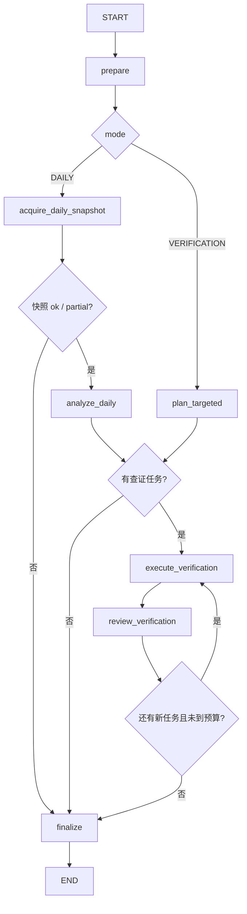

# SentimentAndFlowAnalyst v1

> 实现状态：每日模式、`ResearchRequest` 查证模式、有限补证循环、结构化证据装配和主图适配器已实现。
> 本文描述当前代码，不是远期设想。

## 1. 职责边界

`SentimentAndFlowAnalyst` 只提炼可追溯的资金与交易行为事实，包括：

- 市场、行业和个股资金流候选；
- 北向持股与沪深港通金额；
- 个股与市场两融数据；
- 涨跌停、开板、龙虎榜、机构席位和大宗交易记录。

它不解释资金的真实动机，不把订单大小分类等同于真实机构身份，不预测未来涨跌，
不给出买卖、仓位或目标价建议。`technical_context` 只是市场背景，本 Agent 不把它改写为
技术领域证据。

## 2. LangGraph 子图



入口：

```python
sentiment_graph = build_sentiment_flow_agent_graph(
    model=sentiment_flow_reasoning_model,
    tool_context=research_tool_context,
)
```

嵌入主图时传入 `sentiment_flow_agent_graph_factory`：

```python
research_graph = build_research_graph(
    technical_agent_graph_factory=build_technical_graph_for_run,
    sentiment_flow_agent_graph_factory=build_sentiment_graph_for_run,
)
```

当前主图先执行技术阶段，再执行情绪资金、基本面和新闻事件阶段。这是四个已实现切片的临时串行接法；
四证据 Agent 当前仍按临时顺序串行；后续候选观点生成和逐观点查证图已经实现。

## 3. 每日模式

```python
await sentiment_graph.ainvoke(
    {
        "run_id": run_id,
        "target": market_target,
        "as_of": frozen_as_of,
        "mode": "DAILY",
    }
)
```

固定步骤：

1. 程序调用 `get_daily_sentiment_flow_snapshot`；若聚合 JSON 过大，只允许把每组候选数缩到 3 重试一次；
2. LLM 一次读取市场资金、行业资金、个股资金与涨跌停候选；
3. LLM 输出快照直接证明的 `SentimentFlowEvidenceDraft[]`；
4. 如果单日候选需要多日持续性、杠杆、北向持股或异常交易证实，LLM 输出最小查证请求；
5. 程序把查证枚举映射成固定 Tool 和参数，再把实际结果交给 LLM 复核；
6. 确定性装配器校验调用编号、状态、标的归属和源数据，最终产生 `EvidenceRecord[]`。

每日查证窗口以快照内的 `trade_date` 为终点，而不是直接使用运行当天的自然日。因此周末、
节假日补跑不会错误查询非交易日；每日模式的 `UNUSUAL_TRADING` 也只能查询该快照交易日。

每日快照可以证明某日某一口径的金额、方向和候选身份，但不能单独证明资金
已经连续多日流入、出现拐点、来自某一真实主体，或将在未来推动价格。

## 4. 查证模式与确定性 Tool 映射

外部观点审查节点产生 `assigned_domain=SENTIMENT_FLOW` 的个股 `ResearchRequest` 后调用：

```python
await sentiment_graph.ainvoke(
    {
        "run_id": run_id,
        "target": research_request.target,
        "as_of": frozen_as_of,
        "mode": "VERIFICATION",
        "research_request": research_request,
    }
)
```

它不重新扫全市场快照。LLM 只输出三类受控查证维度：

```text
ACTIVE_MONEY_FLOW  -> get_stock_active_money_flow_context
CAPITAL_POSITIONING -> get_capital_flow_context
UNUSUAL_TRADING    -> get_unusual_trading_activity
```

- `ACTIVE_MONEY_FLOW` 分别读取 THS 与 DC 区间资金流；
- `CAPITAL_POSITIONING` 读取北向持股、个股两融、两融资格和市场两融汇总，程序按 `.SH/.SZ` 生成 `SSE/SZSE`；
- `UNUSUAL_TRADING` 读取明确交易日的大宗交易、龙虎榜和机构席位，请求必须提供 `event_trade_date`。

完成状态由程序更新：`COMPLETED`、`NO_NEW_EVIDENCE`、`FAILED` 或
`CANCELLED_BY_BUDGET`。

## 5. 结构化输出与来源硬校验

每日分析的三个顶层字段是：

```json
{
  "snapshot_evidence": [],
  "verification_requests": [],
  "market_summary": "只索引前两项的重点，不新增事实或预测"
}
```

证据草稿只保留业务描述与真实 `source_call_ids`：

```json
{
  "target": {"type": "STOCK", "code": "000001.SZ", "name": "平安银行"},
  "title": "两种口径的区间资金方向一致",
  "description": "THS 与 DC 分别显示净流入方向，未对两者求和或平均。",
  "source_call_ids": ["sfc_r1_1_active_money_flow"],
  "tags": ["个股资金流"],
  "limitations": ["THS 与 DC 是独立分类口径"]
}
```

来源装配分两条路：

- 每日快照的完整源表位于 `ResearchDataStore`，程序通过 `context_ref` 反查分页来源；
- 定向资金 Tool 返回受控的行数据，程序通过各 `dataset.source_summary` 装配来源。

草稿必须引用真实存在且状态可用的调用。定向调用还要同时满足：草稿 `target.code` 与程序
实际传给 Tool 的 `ts_code` 一致，并且返回行里出现的全部 `data.ts_code` 都只能是该标的；
至少要有一条同标的股票行，市场级无代码汇总不能独自证明个股事实。`empty` 是例外，它只
能支持“该精确查询没有记录”。因此无论是 LLM 移花接木，还是上游忽略过滤条件返回了其他
股票，程序都会拒绝相应证据。

## 6. 口径与状态规则

- THS 与 DC 绝不相加、平均或互相替代；方向一致只能表述为“跨口径方向一致”；
- 方向冲突必须保留分歧并写入 `limitations`；
- 订单大小分类、北向持股、两融、龙虎榜和机构席位是不同渠道，不得混写为同一主体；
- `ok` 可正常引用；`partial` 只引用成功数据集并披露缺失；
- `empty` 只支持“精确接口和窗口内无记录”；`error/too_large` 不能用作证据。

每日快照显式携带 `authorized_targets`，它由技术背景、行业资金候选、个股资金候选和涨跌停候选
确定性合并而成。Prompt 与子图校验器读取同一份清单，避免“快照里已有标的，但校验器漏扫嵌套
字段”造成误拒绝。单个定向 Tool 的 `error/too_large` 会进入运行诊断但不会成为来源；已有其他合法
证据时阶段仍可完成，最终无证据时才按失败处理。

## 7. 循环与预算

| 限制 | 默认值 |
|---|---:|
| 每个快照候选组数量 | 10 |
| 查证轮数 | 2 |
| 每轮最多请求 | 4 |
| 子图总 Tool 调用 | 24 |
| 主图情绪资金 `ResearchRequest` | 20 |

相同标的、查证维度、窗口和事件日期会按指纹去重。第二轮只能研究第一轮已授权的股票。
预算是程序硬限制，不依赖 Prompt 自觉。技术和情绪资金两个主图阶段使用独立请求计数，
同时保留 `research_request_count` 作为全局已处理数。

## 8. LLM 与 Prompt

模型与技术 Agent 共享 `LLMSettings` 和 `build_chat_model(settings)`，但使用独立的
`OpenAISentimentFlowReasoningModel`：

```python
sentiment_model = OpenAISentimentFlowReasoningModel(
    chat_model,
    structured_output_method=settings.structured_output_method,
)
```

三份完整 Prompt 位于：

```text
src/stock_research_agent/agents/sentiment_flow/prompts.py
```

- `DAILY_ANALYSIS_SYSTEM_PROMPT`
- `TARGETED_PLANNING_SYSTEM_PROMPT`
- `VERIFICATION_REVIEW_SYSTEM_PROMPT`

三个通道分别用 `DailySentimentFlowAnalysis`、`TargetedSentimentFlowPlan` 和
`SentimentFlowReviewDecision` 作为结构化输出 Schema，并在本地再执行 Pydantic 校验。
每日 Prompt 包含一个精简 few-shot，只演示字段、证据与查证边界，不是真实行情。

当前单元测试用 scripted fake model，不访问真实 LLM。情绪资金三个新 Schema 尚未在真实
Qwen 端点做独立 smoke test，不应把离线通过误报为真实模型联调成功。

## 9. 当前边界

- `ResearchDataStore` 仍为进程内实现，快照 `context_ref` 不支持跨进程恢复；
- 情绪资金 Tool observation 目前只在子图状态中存活，尚未进入长期 ArtifactStore；
- 目前只允许定向查证 A 股个股，不对行业或市场层级生成两融/龙虎榜请求；
- 新闻事件 Agent、观点生成、逐观点查证、投资经理协商和报告生成已实现；报告持久化仍未实现。
