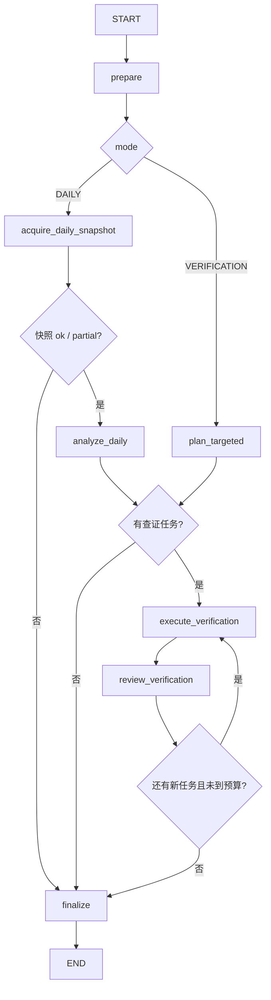

# TechnicalResearchAnalyst v1

> 实现状态：每日模式、ResearchRequest 查证模式、有限补证循环、结构化证据装配和主图适配器已实现。
> 本文描述的是当前代码，不是远期设想。

## 1. 职责边界

`TechnicalResearchAnalyst` 只产生可追溯的技术观察事实：市场宽度、指数/行业表现、趋势、动能、
风险、量能和相对强弱。它不预测未来涨跌，不生成买卖、仓位或目标价建议。

LLM 不直接填写以下字段：

- Provider 名称、接口字段、分页参数；
- `context_ref`；
- `evidence_id`、`run_id`、来源时间；
- 最终 `VerificationStatus`。

这些内容由 Tool、DataStore 和确定性证据装配器提供。

## 2. LangGraph 子图



入口：

```python
technical_graph = build_technical_agent_graph(
    model=technical_reasoning_model,
    tool_context=research_tool_context,
)
```

该子图可以独立执行。嵌入主图时传入 `technical_agent_graph_factory`；主图先生成本轮
`run_id/as_of`，再让 factory 创建与它们严格一致的 `ResearchToolContext` 和技术子图：

```python
research_graph = build_research_graph(
    technical_agent_graph_factory=build_graph_for_run,
)
```

同一 run 内的每日模式和定向查证会复用该子图，离开技术阶段后自动释放。未注入 factory 时，
默认 CLI 只做初始化 smoke test，不读取 LLM 配置或发起模型请求。

## 3. 每日模式

```python
await technical_graph.ainvoke(
    {
        "run_id": run_id,
        "target": market_target,
        "as_of": frozen_as_of,
        "mode": "DAILY",
    }
)
```

固定步骤：

1. 程序正常调用一次 `get_daily_technical_market_snapshot`；若结果为 `too_large`，只允许缩小候选数重试一次；
2. Tool 一次提供完整的市场指数、申万行业宽度和五类异常候选摘要；
3. LLM 输出快照已经直接证明的 `TechnicalEvidenceDraft[]`；
4. 若需要多日趋势、动能、量能、风险或相对强弱，LLM 输出查证请求；
5. 程序执行查证并把结果交回 LLM；
6. 确定性装配器把合法草稿转换为 `EvidenceRecord[]`。

快照直接能证明单日横截面，但不能单独证明 RSI、MACD、多日趋势、放量确认或超额收益。

## 4. 查证模式

外部观点审查节点产生 `assigned_domain=TECHNICAL` 的 `ResearchRequest` 后调用：

```python
await technical_graph.ainvoke(
    {
        "run_id": run_id,
        "target": research_request.target,
        "as_of": frozen_as_of,
        "mode": "VERIFICATION",
        "research_request": research_request,
    }
)
```

它不会重新运行全市场快照。LLM 先把问题映射为最小测量集合，程序执行：

```text
stock -> get_stock_price_context
index -> get_index_market_context
fund  -> get_fund_market_context

RETURN_TREND       -> calculate_return_and_trend
MOMENTUM           -> calculate_momentum
RISK_TRADABILITY   -> calculate_risk_and_tradability
VOLUME_LIQUIDITY   -> calculate_volume_and_liquidity
RELATIVE_STRENGTH  -> calculate_relative_strength
```

申万 `.SI` 代码由 `get_index_market_context` 自动路由到 `sw_daily`；其他市场/中证指数仍使用
`index_daily + index_dailybasic`。

结束后，同一条 `ResearchRequest` 会被确定性更新：

- 有合法新证据：`COMPLETED`；
- 没有新证据：`NO_NEW_EVIDENCE`；
- 运行失败且没有证据：`FAILED`。
- Tool 调用预算不足：`CANCELLED_BY_BUDGET`。

技术节点每轮最多深入查证 3 个目标。这个上限位于程序预算层，而不是只写在 Prompt 中：即使
模型提出更多候选，子图也只执行优先级最高的三个，避免单轮复核上下文和 Tool 调用数量失控。

## 5. LLM 结构化契约

LLM 生成的证据只是草稿：

```json
{
  "target": {"type":"STOCK","code":"000001.SZ","name":"平安银行"},
  "title": "收盘价位于二十日均线上方",
  "description": "确定性计算显示最新收盘价高于二十日均线。",
  "source_call_ids": ["tc_r1_1_return_trend"],
  "tags": ["趋势", "均线"],
  "limitations": []
}
```

程序只接受真实存在且状态可用的 `source_call_ids`，再从其 `source_context_refs` 反查
DataStore 中的 Provider、抓取时间和数据日期。如果引用不存在、调用失败、引用跨 run，或证据标的
与调用的第一数据主体不一致，草稿会被拒绝。`too_large` 原始结果可以供计算器读取完整上下文，
但不能直接作为 LLM 证据来源。

## 6. 循环与预算

默认硬限制：

| 限制 | 默认值 |
|---|---:|
| 每个候选组数量 | 6 |
| 查证轮数 | 2 |
| 每轮最多请求 | 3 |
| 总 Tool 调用 | 24 |

相同标的、测量、窗口和基准会按指纹去重。第二轮只能继续研究第一轮已经授权的标的或基准，
不能由模型凭空引入新证券。预算在程序中执行，不依赖 Prompt 自觉。

`A_SHARE` 只表示 A 股全市场研究范围，不是行情接口接受的指数代码。定向技术计划若以它作为
`index` 查证目标，程序会在 Schema 接受后、执行 Tool 前按请求顺序确定性映射为沪深300
（`000300.SH`）、中证500（`000905.SH`）或中证1000（`000852.SH`），并把代理关系追加到任务
`reason`。这样既保留原始 ResearchRequest 的市场级语义，也不会把 `A_SHARE` 错传给指数行情接口。

## 7. LLM 配置

模型连接与行情 Token 完全分离：

```dotenv
LLM_BASE_URL=https://dashscope.aliyuncs.com/compatible-mode/v1
LLM_API_KEY=replace-with-dashscope-api-key
LLM_MODEL=qwen3.8-max
LLM_REQUEST_TIMEOUT_SECONDS=1200
LLM_MAX_RETRIES=2
LLM_TEMPERATURE=0
LLM_STRUCTURED_OUTPUT_METHOD=json_schema
```

```python
settings = LLMSettings()
chat_model = build_chat_model(settings)
technical_model = OpenAITechnicalReasoningModel(
    chat_model,
    structured_output_method=settings.structured_output_method,
)
```

API Key 使用 `SecretStr`，不会进入 LangGraph State 或 Prompt。

## 8. Prompt 源文件

三份完整 Prompt 位于：

```text
src/stock_research_agent/agents/technical/prompts.py
```

- `DAILY_ANALYSIS_SYSTEM_PROMPT`
- `TARGETED_PLANNING_SYSTEM_PROMPT`
- `VERIFICATION_REVIEW_SYSTEM_PROMPT`

生产实现使用 `with_structured_output(...)`。当前选择的阿里云 `qwen3.8-max` 使用原生
`json_schema`；普通单元测试仍使用 scripted fake model，不访问真实 LLM。2026-08-22 的显式
smoke test 已分别验证普通对话、最小严格 Schema，以及 `DailyTechnicalAnalysis`、
`TargetedTechnicalPlan`、`VerificationReviewDecision` 三个项目 Schema。

每日分析不依赖模型在自由文本中手写 JSON。`DailyTechnicalAnalysis` 的 Pydantic Schema
会作为结构化输出契约传给模型，并在返回后再执行本地校验。它包含两个业务结果集合：
`snapshot_evidence` 和 `verification_requests`，以及一个必填的索引性摘要
`market_summary`。Prompt 中额外保留一个精简 few-shot，它只教字段语义和证据/查证边界，
不是真实行情数据。

## 9. 当前边界

- `ResearchDataStore` 仍是进程内实现，`context_ref` 不支持跨进程恢复；
- 计算结果尚未进入独立长期 ArtifactStore，当前 Tool observations 保存在技术子图状态；
- 四位证据 Agent、观点生成、逐观点查证、投资经理协商和完整报告均已实现；
- 当前已验证阿里云百炼 OpenAI-compatible 端点与 `qwen3.8-max` 的结构化输出；更换端点或模型后
  仍需重新执行显式 smoke test。
