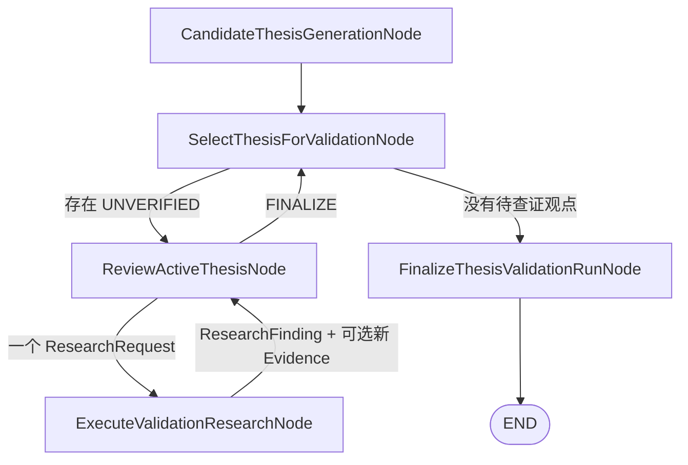

# ThesisValidationAnalyst 逐观点查证节点 v1

> 实现状态：候选观点串行选择、连续上下文审阅、即时定向补证、`ResearchFinding`、硬预算、
> 重复请求保护、Collector 回灌和最终状态固化均已实现。

## 1. 节点职责

`ThesisValidationAnalyst` 是投资论点审查员。它不负责产生投资建议，而是把首席研究策略师生成的
`UNVERIFIED ThesisRecord` 逐条变成以下四种终态之一：

- `SUPPORTED`：核心主张有直接决定性支持；
- `REFUTED`：核心主张有直接决定性反证；
- `MIXED`：正反两侧均有直接决定性证据；
- `INCONCLUSIVE`：关键事实仍缺失、工具覆盖不足或现有证据无法区分解释。

查不到、数据源失败和工具覆盖不足只描述“本轮没有得到可引用事实”，不能被当成反证。

## 2. 主图流程



程序始终只维护一个 `active_validation_session`。观点 A 没有终结前不会选择观点 B。因此一次补证的
实际顺序是：

```text
审阅 A → 生成 A 的一个请求 → 立即执行 → 把 Finding/新证据回给 A → 再次审阅 A
```

不是把请求放入公共队尾，也不是切换新上下文后重新开始。这里的“连续上下文”由程序完整重放
`previous_turns` 实现，不依赖模型服务端保存聊天记忆。

## 3. 模型输入与输出

每轮模型接收 `ThesisValidationInput`：

| 字段 | 含义 |
|---|---|
| `run_id`, `as_of` | 本轮运行身份和冻结时点 |
| `thesis` | 当前唯一正在审阅的观点 |
| `evidence` | 当前可引用的 Collector 证据摘要 |
| `previous_turns` | 已执行的 `请求 → Finding` 完整历史 |
| `used_request_fingerprints` | 已执行请求的确定性指纹 |
| `current_round` | 当前模型审阅轮次 |
| `remaining_research_rounds` | 剩余可执行补证次数 |
| `max_discovered_candidates` | 本轮最多可旁路提出的新观点数 |
| `policy_notes` | 证据状态、执行和引用边界 |

同目标、已由 Collector 接受的全局证据会自动进入该观点上下文；观点原先引用的证据和此前查证命中的
证据也必须完整存在。若必需 ID 缺失，节点失败关闭，不让模型基于残缺上下文判断。

模型传输边界输出 `ThesisValidationModelOutput`，其中 `decision` 是以 `action` 为判别字段的二选一对象：

1. `REQUEST_RESEARCH`：恰好携带一个 `ValidationResearchRequestDraft`；
2. `FINALIZE`：恰好携带一个传输用 finalization，其中非空 `evidence_assessments[]` 逐条把
   `evidence_id` 标为 `SUPPORTING` 或 `CONTRADICTING`。

适配器随后把传输对象确定性转换为领域层 `ThesisValidationDecision`，其中
`evidence_assessments[]` 被拆成 `supporting_evidence_ids` 和 `contradicting_evidence_ids`。这样动作互斥、
终态范围和“至少引用一条证据”都能在云端 JSON Schema 中显式表达。程序负责生成请求 ID、请求指纹、
状态、attempt 和时间戳，模型不能填写这些运行字段。

## 4. ResearchFinding：未知不是证据

每个实际执行过的请求都生成一个可审计 `ResearchFinding`：

| outcome | 语义 | 可否携带 `evidence_ids` | 能否充当反证 |
|---|---|---:|---:|
| `EVIDENCE_FOUND` | 命中 Collector 接受的真实记录 | 必须 | 由证据内容决定 |
| `NO_MATCHING_EVIDENCE` | 已搜索来源内没有匹配结果 | 不可 | 不可 |
| `INSUFFICIENT_TOOL_COVERAGE` | 当前 Tool 无法回答 | 不可 | 不可 |
| `SOURCE_UNAVAILABLE` | 数据源或网络暂不可用 | 不可 | 不可 |
| `REQUEST_FAILED` | 执行或返回契约失败 | 不可 | 不可 |
| `BUDGET_EXHAUSTED` | 已创建请求因预算取消 | 不可 | 不可 |

`finding_id` 必须由 `run_id + request_id + attempt` 稳定生成。请求状态、Finding outcome、attempt、
完成时点和证据 ID 在 Pydantic 模型中交叉校验，不能构造 `COMPLETED + NO_MATCHING_EVIDENCE`
一类矛盾历史。同一个稳定 ID 一旦写入便不可用不同内容覆盖，reducer 会失败关闭以保护审计记录。

若查证命中的证据已经存在于全局池，它仍然是 `EVIDENCE_FOUND`，会被当前观点复用；只是摘要会明确
其中有多少条是首次进入全局池。只有 Collector 接受的记录才能进入 Finding 的 `evidence_ids`。

## 5. 定向研究执行

`ExecuteValidationResearchNode` 按 `active_validation_request_id` 精确寻找当前请求，并直接调用对应领域
子图的 `VERIFICATION` 模式：

| `assigned_domain` | 执行子图 | 当前目标范围 |
|---|---|---|
| `TECHNICAL` | TechnicalResearchAnalyst | 市场、板块、股票 |
| `FUNDAMENTAL` | FundamentalResearchAnalyst | 股票 |
| `SENTIMENT_FLOW` | SentimentAndFlowAnalyst | 股票 |
| `EVENT` | EventDrivenResearchAnalyst | 股票 |

第一版不生成 `MACRO` 定向请求。宏观材料仍可作为初始证据参与观点，后续若要定向查询需先补独立可执行
路由，而不是把分类枚举假装成 Agent。

执行层会验证返回的 `completed_research_request` 未篡改请求身份、问题、目标、时间范围和其他不可变
字段，并要求完成状态与本次返回的 Evidence ID 完全一致。任何矛盾结果整组拒绝，不会污染全局池。
每条 Evidence 还必须属于当前 run 和请求领域；基本面、情绪资金、新闻事件必须与请求目标完全一致。
技术链除请求主目标外只允许显式白名单中的沪深300、中证500和中证1000比较基准，并且至少返回一条
请求主目标自身的证据，不能把另一只股票的事实串入当前观点。

新 Evidence 先与审计用 `evidence_pool` 合并，再重新运行 `EvidenceCollectorNode`。原始但不合格的记录
可以留在审计池；只有 `evidence_collection` 接受的 ID 才能进入当前模型上下文。

## 6. 停止条件和硬预算

默认 `ThesisValidationLimits`：

| 限制 | 默认值 |
|---|---:|
| 单观点补证请求 | 2 |
| 验证阶段全局补证请求 | 20 |
| 每轮新观点 | 1 |
| 全运行审查员发现的新观点 | 2 |
| 单次连续上下文字符数 | 120000 |

预算计数使用独立的 `validation_research_request_count`，不会被四位证据研究员每日阶段自己的内部查证
次数提前耗尽。总运行的 `research_request_count` 仍保留所有领域请求的全局审计计数。

相同结构化请求的稳定指纹会阻止第二次执行。指纹包含目标、领域、问题、所需证据和时间范围；同义改写
无法靠普通哈希可靠识别，因此 Prompt 额外要求模型对照 `previous_turns` 解释新颖性。若模型在预算为
零时仍请求补证、重复相同请求、上下文超限或模型调用失败，当前观点会被程序固化为
`INCONCLUSIVE`，不会无限循环。

共享状态中的 `token_budget_remaining` 和 `time_budget_remaining_seconds` 目前仍是全局工作流骨架字段，
尚未按模型用量或墙钟时间扣减。统一 LLM 观测层会在上游提供时记录每次调用的 token、reasoning token、
耗时和 `finish_reason`，但这些指标当前只用于诊断，不参与 2/20 次数预算或工作流截止判断。

## 7. 最终判断的确定性复核

模型返回 `FINALIZE` 后，程序再次检查：

- 所有引用 ID 必须来自当前 Collector 上下文；
- 同一证据不能同时进入支持和反向集合；
- `SUPPORTED` 至少有一条与观点同目标的 `VERIFIED/REVISED` 决定性支持；
- `REFUTED` 至少有一条与观点同目标的 `VERIFIED/REVISED` 决定性反证；
- `MIXED` 正反两侧都必须满足上述决定性条件；
- `INCONCLUSIVE` 可以高置信度出现：这里的 confidence 是“确信当前确实无法判断”，不是上涨概率。

未来预测不要求等待预测期限结束后才能得到 `SUPPORTED`。如果截至 `as_of` 的同目标
`VERIFIED/REVISED` 证据已经在与期限匹配的关键维度上形成清晰、一致的支持链，并且没有足以动摇
核心方向的直接反证，审查员可以把预测判为 `SUPPORTED`。该状态表示“当前证据明确支持预测”，不
表示未来结果必然发生；一般性风险或“未来尚未发生”本身不能被当成反证。

审查中发现的新解释以 `origin.type=VALIDATOR_DISCOVERY`、`UNVERIFIED` 状态追加到观点池；它不能打断
当前观点，会在当前观点结束后按相同流程接受查证。

## 8. Prompt 和 few-shot

完整 Prompt 位于：

```text
src/stock_research_agent/agents/validator/prompts.py
```

其中包含三组核心示例：首次只提出一个高价值请求；查无结果后不能当成反证；取得直接反证后可以
`REFUTED`。模型适配器通过统一观测层绑定 `ThesisValidationModelOutput` 的纯 JSON Schema，保留原始
响应后再执行本地 Pydantic 校验和领域转换；当前阿里云兼容配置使用项目统一的 `json_schema` 方法。
字段级失败、纠正调用和关联 ID 见
[`llm-structured-output-observability-v1.md`](llm-structured-output-observability-v1.md)。

## 9. 构建方式

```python
from stock_research_agent.agents.validator import (
    OpenAIThesisValidationAnalystModel,
    ThesisValidationLimits,
)
from stock_research_agent.llm import build_chat_model

chat_model = build_chat_model(llm_settings)
validator = OpenAIThesisValidationAnalystModel(
    chat_model,
    structured_output_method=llm_settings.structured_output_method,
    structured_output_options=structured_output_options,
)

graph = build_research_graph(
    technical_agent_graph_factory=technical_factory,
    sentiment_flow_agent_graph_factory=sentiment_factory,
    fundamental_agent_graph_factory=fundamental_factory,
    event_agent_graph_factory=event_factory,
    lead_research_strategist_model=strategist,
    thesis_validation_model=validator,
    thesis_validation_limits=ThesisValidationLimits(),
)
```

只注入 validator 而不注入 strategist 会在构图时直接报错。当前正式 CLI 已通过
`ResearchRuntime` 注入真实 Agent/LLM，并固定以 `MARKET / A_SHARE / A股市场` 启动每日链。

当前版本尚未实现 checkpoint 恢复。主图启动只接受 `target/as_of/run_id` 和用于专项测试或调度的
预置 `research_requests`；若把上一轮的 Evidence、Thesis、Finding、错误或活动验证会话作为新输入，
入口会直接拒绝，避免列表 reducer 把旧状态合并进新 run。Runtime 默认把 LangGraph
`recursion_limit` 设置为 300，为四领域采集、每观点最多两轮补证、有限衍生观点和正式协商预留
足够拓扑步数；部署方显式覆盖时不能低于 50。

## 10. 测试边界

`tests/test_thesis_validation.py` 覆盖：

- `A → A 即时复审 → B` 的严格串行顺序；
- 新证据经 Collector 回填同一上下文；
- 查无结果不生成假证据；
- 缺失领域执行器生成工具覆盖不足 Finding；
- 篡改完成对象不能污染全局 Evidence；
- 错误领域、错误 run 或未授权目标的证据在 Coordinator 最终边界被拒绝；
- 全局已有证据可被查证命中并复用；
- 精确重复请求阻断；
- 单观点 3 轮和验证阶段全局预算硬限制；
- LLM 适配器采用结构化输出 Schema。

这些是确定性契约测试，不代表真实 Provider 和真实 LLM 已完成端到端联调。
