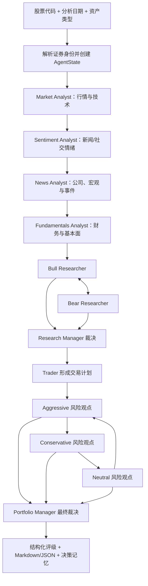

# TradingAgents 源码与运行流程参考

> 核对日期：2026-08-14
> 上游仓库：[TauricResearch/TradingAgents](https://github.com/TauricResearch/TradingAgents)
> 核对版本：`main` commit `a33fd4c0f134485a43553a2c23a63cb14adbd88f`，项目版本 v0.3.1
> 文档性质：固定版本的外部项目阅读笔记，不是 StockResearchAgent 当前实现说明

## 1. 阅读范围

本文只描述上方固定 commit。下文源码路径均是**相对于该上游仓库根目录**的路径；需要
重新核对时，应在 MyServer 之外单独克隆：

```bash
git clone --depth 1 https://github.com/TauricResearch/TradingAgents.git \
  /Users/augustus/IdeaProjects/TradingAgents
```

## 2. 它是什么，不是什么

TradingAgents 是一个 Python + LangGraph 多智能体研究框架，试图模拟投研机构中分析、研究辩论、交易计划与风险复核的分工。

它提供：

- 交互式 CLI；
- Python 包调用入口；
- 多 LLM Provider；
- 行情、新闻、财务等工具封装；
- LangGraph 状态图；
- Markdown 报告、JSON 状态、决策记忆与可选 checkpoint。

它当前没有正式 FastAPI/HTTP 服务，也没有成熟 Web 前端。README 提到“将订单发送到模拟交易所”，但当前实际图在 Portfolio Manager 后直接 `END`，代码中没有券商下单、模拟撮合或 exchange node。因此应把它视为**分析与决策研究脚手架**，而不是已经验证的自动交易系统。

## 3. 如何运行

### 3.1 CLI

`pyproject.toml` 注册的命令入口是：

```text
tradingagents = "cli.main:app"
```

安装后主要通过交互式 CLI 选择股票、日期、分析师、LLM、辩论轮数和输出配置。README 推荐 Python 3.12，项目声明 Python 3.10 及以上。

### 3.2 Python 程序入口

根目录 `main.py` 的核心调用非常简单：

```python
from tradingagents.default_config import DEFAULT_CONFIG
from tradingagents.graph.trading_graph import TradingAgentsGraph

config = DEFAULT_CONFIG.copy()
graph = TradingAgentsGraph(debug=True, config=config)
final_state, decision = graph.propagate("NVDA", "2024-05-10")
```

真正的总控类是：

```text
tradingagents/graph/trading_graph.py::TradingAgentsGraph
```

## 4. 总体运行流程



分析师不是并行执行，而是按固定顺序串行。每个普通分析师采用以下循环：

```text
LLM 决定是否调用工具
  ├─ 有 tool_calls → ToolNode 执行 → 返回同一个分析师
  └─ 无 tool_calls → 写报告 → 清理临时 messages → 下一个分析师
```

图定义位于 `tradingagents/graph/setup.py`，条件路由位于 `tradingagents/graph/conditional_logic.py`。

## 5. 各阶段在代码里如何工作

### 5.1 初始化与证券身份锁定

`TradingAgentsGraph.propagate(ticker, trade_date, asset_type)`：

1. 读取同一股票过去的决策记忆；
2. 解析 ticker 对应的真实证券身份；
3. 将 `instrument_context` 注入所有 Agent；
4. 创建初始 `AgentState`；
5. 如果启用 checkpoint，按“股票 + 日期 + 图结构签名”恢复；
6. 调用 LangGraph。

身份锁定非常值得借鉴。仅把 `000001.SZ` 交给 LLM 容易让模型猜错公司；应先由确定性数据源解析为代码、名称、交易所、行业和上市状态，再让所有节点共享。

### 5.2 Analyst Team

#### Market Analyst

注册工具：

- `get_stock_data`；
- `get_indicators`；
- `get_verified_market_snapshot`。

默认关注均线、MACD、RSI、布林带、ATR、VWMA 等技术指标。`verified_market_snapshot` 用确定性快照约束模型，避免模型在报告里编造最新价格或指标。

#### Sentiment Analyst

当前版本预取 Yahoo 新闻、StockTwits 和 Reddit 数据，然后输出情绪区间、0–10 评分、置信度和解释。它与早期“Social Analyst”名称兼容，但对 A 股帮助有限：StockTwits/Reddit 的覆盖和代表性不足。

#### News Analyst

图中的 ToolNode 注册：

- 个股新闻；
- 全球新闻；
- 内部人交易；
- FRED 宏观数据；
- Polymarket 预测市场。

实际 `news_analyst.py` 的工具列表与图注册存在一处小不一致：图注册了 insider transactions，但当前分析师工具列表未实际使用它。阅读开源项目时要以实际节点绑定为准，不能只看 README。

#### Fundamentals Analyst

注册工具：

- company fundamentals/overview；
- balance sheet；
- cash flow；
- income statement。

其数据供应商主要是 Yahoo Finance 和 Alpha Vantage，不包含 Tushare、A 股公告、机构调研、资金流或卖方研报。这是我们不能直接套用它的主要原因。

### 5.3 Bull/Bear Research Debate

四份专业报告进入多空研究员：

- Bull Researcher 强制寻找支持上涨或买入的证据；
- Bear Researcher 强制指出基本面、估值、技术和事件风险；
- 二者按 `max_debate_rounds` 交替；
- Research Manager 使用 deep-thinking LLM 做最终裁决，生成结构化研究计划。

路由终止条件是辩论消息计数达到 `2 × max_debate_rounds`。

这一步最符合你的目标：不是让模型简单总结几份报告，而是强制构造相反假设，再由裁决节点判断哪些观点获得数据支持。

### 5.4 Trader

Trader 使用 quick-thinking LLM 把研究计划转成结构化的三档行动：

- Buy；
- Hold；
- Sell。

同时包括 reasoning、入场考虑、止损和仓位建议。它生成的是计划文本，并没有连接券商。

### 5.5 Risk Debate 与 Portfolio Manager

三个风险角色依次发言：

- Aggressive：强调机会和可承担风险；
- Conservative：强调回撤、流动性和尾部风险；
- Neutral：进行折中与情景分析。

计数达到 `3 × max_risk_discuss_rounds` 后，Portfolio Manager 使用 deep-thinking LLM 输出五档评级：

- Buy；
- Overweight；
- Hold；
- Underweight；
- Sell。

同时包含执行摘要、投资逻辑、目标价和期限。随后图直接结束。

## 6. State 结构

`tradingagents/agents/utils/agent_states.py` 中的 `AgentState` 主要字段：

```text
company_of_interest
asset_type
instrument_context
trade_date
messages
sender
market_report
sentiment_report
news_report
fundamentals_report
investment_debate_state
investment_plan
trader_investment_plan
risk_debate_state
final_trade_decision
past_context
```

其中 `investment_debate_state` 保存多空历史、当前发言、裁决和轮数；`risk_debate_state` 保存激进/保守/中性观点、当前发言人、裁决和轮数。

这个设计简洁，但报告在节点之间主要以长字符串传递，证据来源容易丢失。我们的版本更适合把每条结论结构化为：

```json
{
  "claim": "经营现金流改善",
  "evidence_ids": ["cashflow:000001.SZ:20260630"],
  "counter_evidence_ids": [],
  "confidence": 0.78,
  "as_of": "2026-08-13T15:30:00+08:00"
}
```

## 7. 数据与工具抽象

`tradingagents/dataflows/interface.py` 是统一工具入口，底层 vendor 路由按类别或单个工具配置：

```python
"data_vendors": {
    "core_stock_apis": "yfinance",
    "technical_indicators": "yfinance",
    "fundamental_data": "yfinance",
    "news_data": "yfinance",
    "macro_data": "fred",
    "prediction_markets": "polymarket",
}
```

显式 vendor chain 才允许 fallback，不会偷偷切换到用户没选的数据源。这一点应保留：不同供应商字段口径、复权方式和资金流定义不同，静默换源会让报告不可复现。

对我们的 A 股项目，可以实现类似接口：

```text
MarketDataProvider
FinancialStatementProvider
ResearchReportProvider
NewsProvider
CapitalFlowProvider
DisclosureProvider
SentimentProvider
```

上层 Agent 只依赖领域模型，不直接依赖 Tushare DataFrame。

## 8. LLM 配置

`tradingagents/default_config.py` 把 LLM 分为：

- quick-thinking：分析师、研究员、Trader；
- deep-thinking：Research Manager、Portfolio Manager。

可通过环境变量配置 provider、模型、endpoint、语言、辩论轮数、checkpoint、temperature 和 retry budget。项目支持多个云端或 OpenAI-compatible Provider。

这种分层可以控制成本，但“deep”并不自动保证正确。数值计算、证券身份、数据截止时间和引用必须由确定性代码约束。

## 9. 输出、checkpoint 与复盘

### 9.1 报告目录

`tradingagents/reporting.py` 会生成：

```text
1_analysts/
  market.md
  sentiment.md
  news.md
  fundamentals.md
2_research/
  bull.md
  bear.md
  manager.md
3_trading/
  trader.md
4_risk/
  aggressive.md
  conservative.md
  neutral.md
5_portfolio/
  decision.md
complete_report.md
```

另有完整 state JSON 和工具消息日志。

### 9.2 Checkpoint

可选 SQLite LangGraph checkpointer 会按 ticker 保存进度。线程 ID 还包含日期、所选分析师、辩论深度、风险轮数和资产类型，防止图结构改变后错误续跑。成功完成后清理对应 checkpoint。

### 9.3 决策记忆与事后复盘

每次完成后写入持久化 decision log。下一次分析同一股票时，程序尝试取得默认 5 个交易日后的：

- 原始收益；
- 相对地区基准的 alpha；
- LLM 对上次决策的简短反思。

然后把同股票历史和跨股票经验注入 Portfolio Manager。这比“保存聊天记录”更有价值，因为记忆附带了可验证的后验结果。

## 10. 对我们的项目最值得借鉴的部分

1. **先冻结确定性证据，再调用 Agent**：身份、价格、指标、财务比率全部由代码计算。
2. **专业报告分工**：技术、基本面、新闻、情绪各自输出独立报告。
3. **多空反证**：让两个角色主动寻找相反证据，而非只做平均式总结。
4. **裁决节点结构化输出**：最终评级、置信度、期限、失效条件必须有 schema。
5. **数据供应商抽象**：Agent 不直接绑定第三方 API。
6. **完整 provenance**：每条关键结论关联 evidence ID、来源和 `as_of`。
7. **checkpoint 与 job 隔离**：长任务可恢复，失败不会丢掉所有进度。
8. **事后复盘**：用未来收益和基准 alpha 检验当时决策，而不是只让模型自我评价。

## 11. 不建议直接照搬的部分

### 11.1 Trader + 三风险角色可能过重

你不接 MiniQMT，也不执行真实仓位。首版可以简化为：

```text
技术 / 基本面 / 新闻 / 情绪报告
        ↓
Bull / Bear 反证
        ↓
Evidence Auditor（检查数据与引用）
        ↓
Decision Manager（最终评级与失效条件）
```

未来真正管理组合时再引入 Trader、仓位和 Portfolio Risk。

### 11.2 原始 A 股数据覆盖不足

Yahoo `.SS/.SZ` 只能解决部分行情问题。我们的 Provider 应替换成已验证的 Tushare-compatible：

- 日线、复权、每日指标与技术因子；
- 三大报表和财务指标；
- `major_news`；
- 机构调研、资金流与龙虎榜；
- 卖方预测/研报、公告与互动问答（权限验证后启用）。

### 11.3 历史分析存在时点问题

开源项目的部分 live news/social 工具在指定历史日期时仍可能读到当前内容。我们的日终任务必须在收盘后创建 `analysis_snapshot_id`，所有节点只能读取该快照中 `published_at <= as_of` 的数据，防止前视偏差。

### 11.4 进程全局状态和并发

TradingAgents 的 `set_config` 具有进程级配置语义，Graph 对象也保存 `curr_state`、`ticker` 和日志状态；Markdown memory log 不适合多个 Web 请求并发写。

若做网站 API：

- 每次分析创建独立 job；
- job 对应独立 graph/state；
- 使用队列执行长任务；
- 将状态、证据和报告存入数据库/对象存储；
- 不把同一个 `TradingAgentsGraph` 当线程安全单例。

## 12. 建议优先阅读的源码

路径均相对于 TradingAgents 上游仓库根目录：

1. `main.py`：最小程序入口；
2. `tradingagents/graph/trading_graph.py`：总控和执行；
3. `tradingagents/graph/setup.py`：LangGraph 节点和边；
4. `tradingagents/graph/conditional_logic.py`：工具、辩论和风险路由；
5. `tradingagents/agents/utils/agent_states.py`：State schema；
6. `tradingagents/agents/analysts/`：四类分析师；
7. `tradingagents/agents/researchers/`：Bull/Bear；
8. `tradingagents/agents/managers/`：两层裁决；
9. `tradingagents/agents/schemas.py`：结构化决策模型；
10. `tradingagents/dataflows/interface.py`：数据供应商边界；
11. `tradingagents/default_config.py`：配置；
12. `tradingagents/reporting.py`：报告树。

## 13. 官方源码链接

- [README 与架构说明](https://github.com/TauricResearch/TradingAgents/blob/main/README.md)
- [LangGraph 图定义](https://github.com/TauricResearch/TradingAgents/blob/main/tradingagents/graph/setup.py)
- [总控流程](https://github.com/TauricResearch/TradingAgents/blob/main/tradingagents/graph/trading_graph.py)
- [State 定义](https://github.com/TauricResearch/TradingAgents/blob/main/tradingagents/agents/utils/agent_states.py)
- [数据路由](https://github.com/TauricResearch/TradingAgents/blob/main/tradingagents/dataflows/interface.py)
- [默认配置](https://github.com/TauricResearch/TradingAgents/blob/main/tradingagents/default_config.py)
- [结构化输出](https://github.com/TauricResearch/TradingAgents/blob/main/tradingagents/agents/schemas.py)
- [CLI](https://github.com/TauricResearch/TradingAgents/blob/main/cli/main.py)
- [依赖](https://github.com/TauricResearch/TradingAgents/blob/main/pyproject.toml)

---

结论：TradingAgents 最有价值的不是它当前使用的 Yahoo/Reddit 数据源，而是“确定性证据 → 专业报告 → 多空反证 → 深度裁决 → 风险复核 → 可复盘记忆”的组织方式。我们的 A 股版本应保留这条思想主线，同时缩短执行链、强化来源引用和时点一致性。
